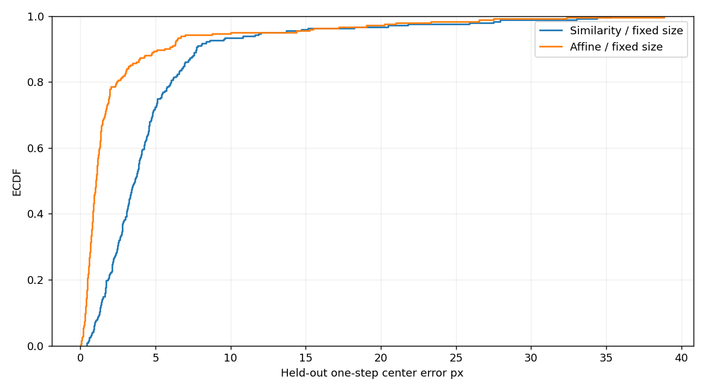
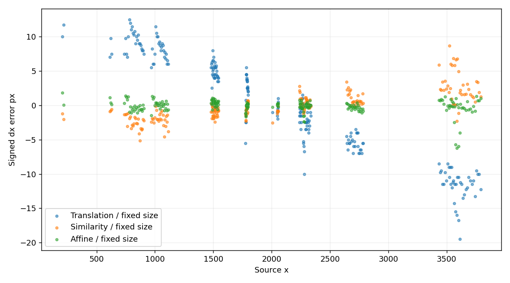
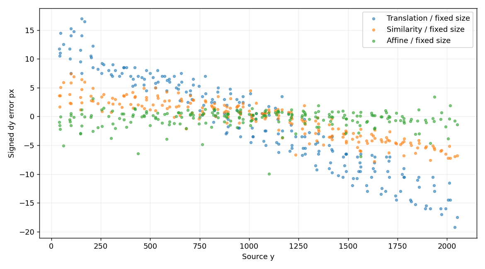
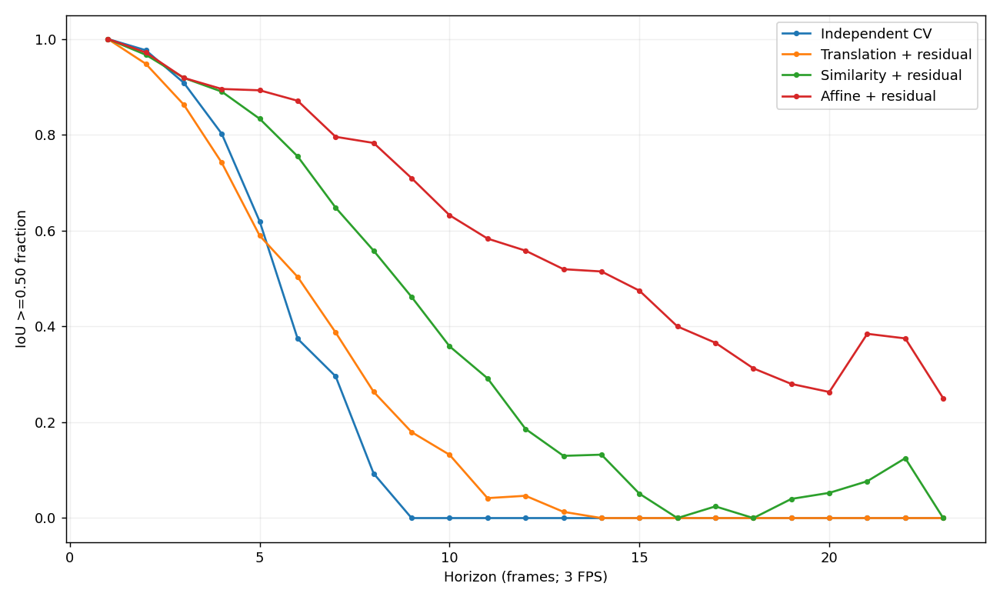
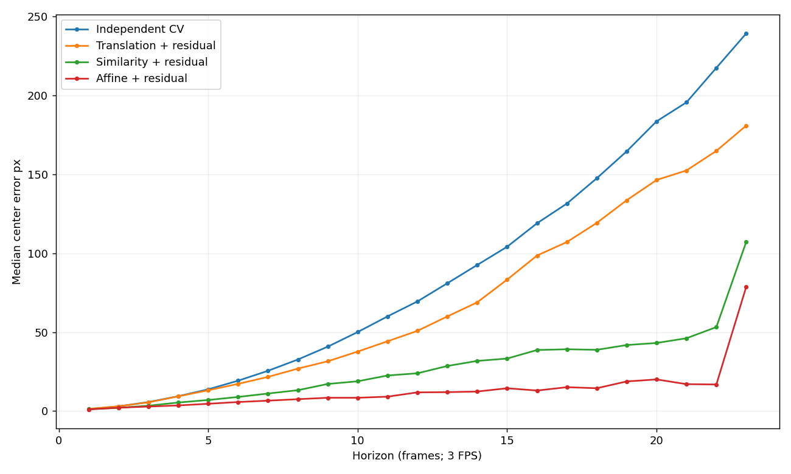
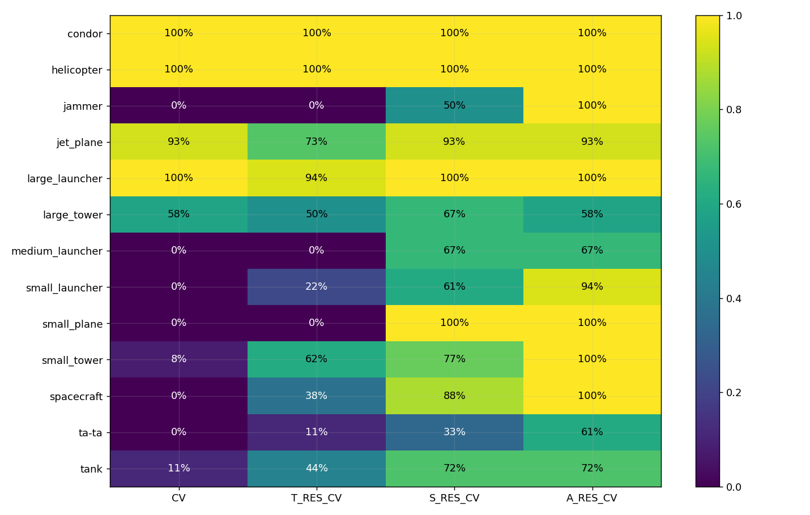
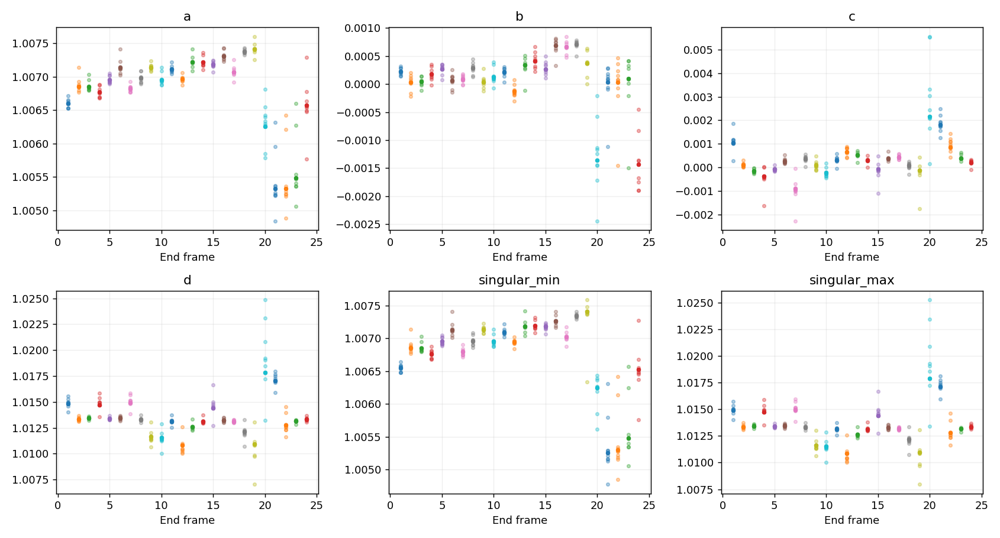
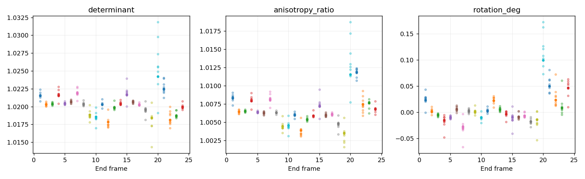
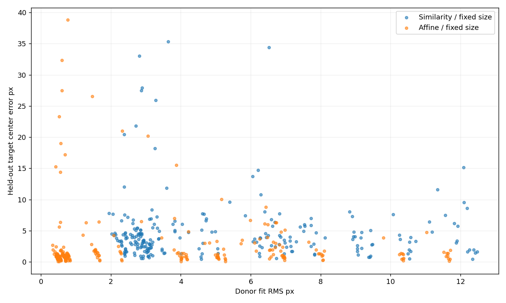

# GT-only strict leave-one-object-out affine motion

## Question

Does full 2-D affine shared motion materially improve held-out target transfer over
the reviewed similarity model enough to justify affine, rather than similarity, as
the first target for a later image-derived global-motion experiment?

**Decision evidence:** affine gives a large, broad oracle improvement over
similarity, removes nearly all of the measured non-boundary position-dependent
error, and remains numerically stable in Helsinki. It is therefore a credible
first image-derived GMC target. This is evidence for the Lead / Orchestrator to
weigh against implementation complexity; it is not an automatic production choice.

## Scope and epistemic status

**MEASURED** denotes direct results; **DERIVED** denotes implications;
**HYPOTHESIS** denotes a candidate explanation; **UNKNOWN** denotes unresolved
questions. Results are Helsinki-only, GT-only oracle geometry. Future GT of
**other objects only** refreshes shared T/S/A transforms. Future target GT is used
only for evaluation. All models have perfect GT initialization. This is not AP,
deployed tracking accuracy, image-motion accuracy, or evidence from hidden flights.

No image read, optical flow, feature matching, RANSAC, homography, detector,
camera policy or production tracker was implemented. No merge or push occurred.

## Repository protection and control reproduction

The worktree was clean on `drone-motion-architecture-experiments`, at `6794da6`
(`Add Drone Flyby oracle similarity motion experiment`). The reviewed similarity
package was already committed, so no new checkpoint commit was necessary. The
translation checkpoint is `d1d195b`. All **93** tracked prior-package and source
files were SHA-256 hashed before and after affine execution and remain unchanged.

The new package loads the five reviewed control rows without reinterpretation.
All **12,280 control rows** (2,456 candidate keys x five models) reproduce exactly,
including raw coordinates, availability and IoUs. The CV gate remains:

| h | Success / N |
| ---: | ---: |
| 1 | 227/227 |
| 2 | 207/212 |
| 3 | 179/197 |
| 4 | 146/182 |
| 5 | 104/168 |
| 6 | 58/155 |
| 9 | 0/117 |

All 2,213 prior CV IoUs, translation results and similarity results remain intact.

## Exact method and leakage controls

For target class `j` and transition k-1 -> k, donors are all other classes visible
at both endpoints. The affine fit uses donor centers only:

`p' = A p + t`, where `A = [[a,b],[c,d]]`.

The estimator uses weighted source/destination centroids, centered coordinates,
a joint weighted 2x2 least-squares map, recovered translation, Euclidean donor
residuals, Huber delta **3 source pixels**, exactly **20** reweighting iterations,
and one final weighted solve. It matches the similarity estimator's robust protocol.
No held-out result was used to tune the settings.

Support requires >=3 donors, RMS spatial spread >=100 px, minor-axis spread >=25
px, covariance eigenvalue ratio >=0.001 and source condition <=10, before and after
weighting; final effective donor N must be >=3. The transform must be finite, have
positive determinant, singular values in [0.5,2], and map condition <=4. Failures
are explicitly unavailable with no fallback. Helsinki produces no failed fit.

`A_FIXED` refreshes affine center transport at every future transition and fixes
the target's origin size. `A_RES_CV` freezes
`r = c_t - F_t(c_(t-1))` in image-axis source pixels, applies
`c_hat(k)=F_k(c_hat(k-1))+r`, and uses exactly the target size-CV policy of CV,
T_RES_CV and S_RES_CV. It never refreshes `r` from future target GT.

Saved donor IDs accompany every transform. The independent validator confirms:

- deleting the entire target trajectory leaves its donor transforms unchanged;
- poisoning all target boxes leaves transforms unchanged;
- the target never appears in its donor list;
- restricted target histories reproduce all predictions;
- future-target-history injection is rejected;
- repeated fitting is deterministic for all 16 held-out classes.

## Strict held-out one-step transfer

This is the primary spatial-generalization test over all 243 consecutive targets,
with fixed target sizes for T/S/A.

| Model | Success / N | Success % | Mean IoU | Median IoU | Mean center px | Median center px | P90 center px |
| --- | ---: | ---: | ---: | ---: | ---: | ---: | ---: |
| Translation | 182/243 | 74.90 | 0.6017 | 0.6083 | 11.443 | 11.011 | 17.007 |
| Similarity | 230/243 | 94.65 | 0.8231 | 0.8600 | 4.788 | 3.621 | 7.701 |
| Affine | **238/243** | **97.94** | **0.9154** | **0.9482** | **2.554** | **1.020** | **5.483** |

On 220 non-boundary transitions:

| Model | Success / N | Median IoU | Mean center px | Median center px | P90 center px |
| --- | ---: | ---: | ---: | ---: | ---: |
| Translation | 172/220 | 0.6099 | 10.464 | 10.571 | 15.522 |
| Similarity | 216/220 | 0.8658 | 3.544 | 3.329 | 6.446 |
| Affine | **220/220** | **0.9517** | **1.322** | **0.932** | **2.844** |

**MEASURED:** affine gains 8/243 over similarity overall and 4/220 on the
non-boundary cohort. It reduces median error another **71.99%** from similarity on
non-boundary targets. Five overall affine failures are boundary-affected cases.

## Remaining spatial structure

The non-boundary diagnostics report correlation, slope and amplitude together.
Signed error means predicted minus true center displacement.

| Diagnostic, N=220 | Translation | Similarity | Affine |
| --- | ---: | ---: | ---: |
| corr(x, dx error) | -0.964663 | +0.775405 | **-0.225254** |
| corr(y, dy error) | -0.962612 | -0.902787 | **+0.002693** |
| within-transition x corr | -0.992583 | +0.776714 | **-0.315414** |
| within-transition y corr | -0.993008 | -0.919070 | **+0.032139** |
| x slope per 1000 source px | -7.6236 | +1.7427 | **-0.2376** |
| y slope per 1000 source px | -14.3055 | -5.5807 | **+0.0075** |
| RMS dx, px | 7.3869 | 2.1015 | **0.9944** |
| RMS dy, px | 8.2762 | 3.4341 | **1.6042** |

**DERIVED:** affine materially reduces both the spatial structure and error
amplitude left by similarity. The remaining x correlation is attached to a tiny
slope and sub-pixel RMS scale, so correlation alone would overstate it. The all-case
affine y RMS is 5.530 px because boundary-clipped boxes contribute large errors;
boundary-free evidence is the cleaner geometric diagnostic.

## Multi-horizon common-cohort results

There are 17,192 saved prediction rows (2,456 candidate keys x seven models).
The all-seven intersection contains **2,213 keys per model**, identical to the
previous target-history cohort. Counts below are IoU >=0.50 successes. All T/S/A
models are **ORACLE REFRESHED SHARED MOTION**.

| h | N | CV | T_RES_CV | S_RES_CV | A_RES_CV |
| ---: | ---: | ---: | ---: | ---: | ---: |
| 1 | 227 | 227 | 227 | 227 | 227 |
| 2 | 212 | 207 | 201 | 205 | **206** |
| 3 | 197 | 179 | 170 | 181 | **181** |
| 4 | 182 | 146 | 135 | 162 | **163** |
| 5 | 168 | 104 | 99 | 140 | **150** |
| 6 | 155 | 58 | 78 | 117 | **135** |
| 7 | 142 | 42 | 55 | 92 | **113** |
| 8 | 129 | 12 | 34 | 72 | **101** |
| 9 | 117 | 0 | 21 | 54 | **83** |
| 10 | 106 | 0 | 14 | 38 | **67** |
| 11 | 96 | 0 | 4 | 28 | **56** |
| 12 | 86 | 0 | 4 | 16 | **48** |

Fixed-size shared transport also separates strongly:

| h | N | T_FIXED | S_FIXED | A_FIXED |
| ---: | ---: | ---: | ---: | ---: |
| 1 | 227 | 175 | 220 | **227** |
| 2 | 212 | 73 | 196 | **211** |
| 3 | 197 | 36 | 152 | **193** |
| 4 | 182 | 8 | 115 | **173** |
| 5 | 168 | 0 | 90 | **160** |
| 6 | 155 | 0 | 75 | **147** |
| 9 | 117 | 0 | 29 | **106** |
| 12 | 86 | 0 | 6 | **73** |

**MEASURED:** A_RES_CV ties S_RES_CV at h=1 and h=3, gains 1 at h=2/h=4,
10 at h=5, 18 at h=6 and increasingly more at longer horizons. A_FIXED is markedly
better than A_RES_CV from h=2 onward. **DERIVED:** after affine explains the shared
field, freezing the last target residual can add noise/bias; target residual is not
automatically beneficial. The fixed-size result should be treated as a serious
baseline, not discarded because prior translation/similarity benefited from residuals.

## h=6 detailed comparison

All results use N=155 and identical target-size CV for the four residual/CV models.

| Model | Success / N | Success % | Mean IoU | Median IoU | Median center px | Median normalized center |
| --- | ---: | ---: | ---: | ---: | ---: | ---: |
| CV | 58/155 | 37.42 | 0.4139 | 0.4448 | 19.235 | 0.3854 |
| T_RES_CV | 78/155 | 50.32 | 0.4608 | 0.5004 | 17.241 | 0.3245 |
| S_RES_CV | 117/155 | 75.48 | 0.6257 | 0.6691 | 8.946 | 0.1836 |
| A_RES_CV | **135/155** | **87.10** | **0.7020** | **0.7669** | **5.731** | **0.1104** |

Affine versus similarity case transitions are: **112 both succeed, 23 affine-only,
5 similarity-only, 15 both fail**. Thus the net +18 is not one-sided: affine
regresses five previously successful cases. Against CV, it gains 78 and loses 1;
against translation residual, it gains 61 and loses 4.

## Class, size and boundary effects at h=6

Affine gains over similarity are concentrated in difficult small classes while
preserving most already-strong classes:

| Class | N | CV | T_RES_CV | S_RES_CV | A_RES_CV |
| --- | ---: | ---: | ---: | ---: | ---: | ---: |
| condor | 4 | 4 | 4 | 4 | 4 |
| helicopter | 12 | 12 | 12 | 12 | 12 |
| jammer | 6 | 0 | 0 | 3 | **6** |
| jet_plane | 15 | 14 | 11 | 14 | 14 |
| large_launcher | 18 | 18 | 17 | 18 | 18 |
| large_tower | 12 | 7 | 6 | **8** | 7 |
| medium_launcher | 3 | 0 | 0 | 2 | 2 |
| small_launcher | 18 | 0 | 4 | 11 | **17** |
| small_plane | 2 | 0 | 0 | 2 | 2 |
| small_tower | 13 | 1 | 8 | 10 | **13** |
| spacecraft | 16 | 0 | 6 | 14 | **16** |
| ta-ta | 18 | 0 | 2 | 6 | **11** |
| tank | 18 | 2 | 8 | 13 | 13 |

The visible class regression is large tower, 8/12 -> 7/12. Individual-case losses
also occur inside aggregate ties. Hangar, medium plane and mine roller have no h=6
common samples; mine roller remains in the one-step analysis.

By L0 origin short side, S_RES_CV -> A_RES_CV is **17/36 -> 28/36** for 4–<8,
**52/70 -> 59/70** for 8–<16, **44/45 -> 44/45** for 16–32, and **4/4 -> 4/4**
above 32. No <4 origin qualifies at h=6. Gains are broad across small-object bins,
but size, class and position are confounded.

Boundary-contact cases improve **11/17 -> 13/17** and non-boundary cases improve
**106/138 -> 122/138**. The affine gain is not a boundary artifact. Boundary flags
are evaluation strata, never features, and do not establish causality.

## Affine stability and incremental degrees of freedom

All 384 cached fits and all 243 consumed transforms pass support/stability checks;
there are **zero unavailable affine transforms**. Used-fit summaries:

| Metric | Min | Median | P90 | Max |
| --- | ---: | ---: | ---: | ---: |
| Donors | 7 | 9 | 10 | 11 |
| Effective donors | 6.847 | 9.000 | 10.000 | 11.000 |
| Source condition | 1.208 | 3.184 | 5.071 | 8.935 |
| Determinant | 1.01436 | 1.02034 | 1.02202 | 1.03184 |
| Singular min | 1.00477 | 1.00695 | 1.00727 | 1.00759 |
| Singular max | 1.00798 | 1.01330 | 1.01529 | 1.02524 |
| Anisotropy ratio | 1.00163 | 1.00634 | 1.00871 | 1.01869 |
| Polar rotation, degrees | -0.0664 | 0.0005 | 0.0451 | 0.1722 |
| Symmetric off-diagonal magnitude | 0.000001 | 0.000304 | 0.000690 | 0.002697 |

The extra affine behavior is small: modest anisotropy and very small symmetric
off-diagonal/shear diagnostic. This should not be interpreted as calibrated camera
physics. It is a fitted image-space mapping over changing donor sets.

## Donor fit versus held-out transfer

| Model | Median donor RMS px | Median held-out center px | Correlation across 243 transitions |
| --- | ---: | ---: | ---: |
| Similarity | 3.541 | 3.621 | -0.056 |
| Affine | 1.562 | 1.020 | -0.073 |

Affine improves both donor fit and held-out transfer. The near-zero within-model
correlations show that donor residual alone is a poor per-case selector. The model
conclusion comes from held-out IoU/error and spatial structure, not donor fit.

## What worked, what regressed, and what not to repeat blindly

**Worked:** affine center transport explains the unequal x/y residual left by
similarity; gains persist through long oracle propagation, cover multiple small
classes/size bins, and occur with stable, well-supported transforms.

**Regressed/failed:** A_RES_CV loses five h=6 similarity successes, large tower
drops by one aggregate success, and five one-step boundary-affected targets remain
below threshold. Adding the frozen residual is worse than A_FIXED after h=1.

Do not repeat blindly: do not assume target residuals always help; do not choose
transforms from donor fit; do not tune numerical gates on held-out targets; do not
infer physical camera parameters; do not treat oracle future donors as available
in a cropped deployed system; and do not extrapolate these one-flight counts to AP.

## Remaining unknowns and evidence for the decision

**UNKNOWN:** whether image-derived affine estimates from backgrounds/features reach
the needed precision; robustness to noise, missing/misassociated detections, crop
coverage and latency; other flights/scenes; optimal confidence/uncertainty; runtime;
and whether an image estimator's support/conditioning differs from GT object-center
support. The one-instance-per-class correspondence assumption is Helsinki-specific.

The Lead / Orchestrator now has evidence that affine yields **+3.29 percentage
points at one step overall**, **100% non-boundary one-step success**, and **+11.61
points at h=6** over similarity residual, while using stable, mildly anisotropic
maps. It also has contrary evidence: extra complexity, five h=6 regressions, boundary
failures, and an affine residual that underperforms pure A_FIXED. The architecture
decision should weigh those oracle gains against the expected reliability and cost
of estimating affine from images. No next architecture stage was started.

## Validation

**PASS:** independent scalar covariance algebra reconstructs all 384 transforms;
all 17,192 predictions and independent IoUs; all 12,280 prior-control rows; 2,213
common keys; 3,514 grouped rows; 486 pairwise rows; 729 one-step rows; 16 target
deletion/poisoning checks; 16 deterministic class refits; future-history rejection;
no-fallback behavior; and known, too-few, coincident/collinear, reflection and
unstable-singular-value fixtures. Nine figures exist and were visually inspected.
All 93 preserved files remain unchanged. A complete repeated run produced identical
SHA-256 hashes for all 22 runner-generated JSON/CSV/PNG artifacts.
