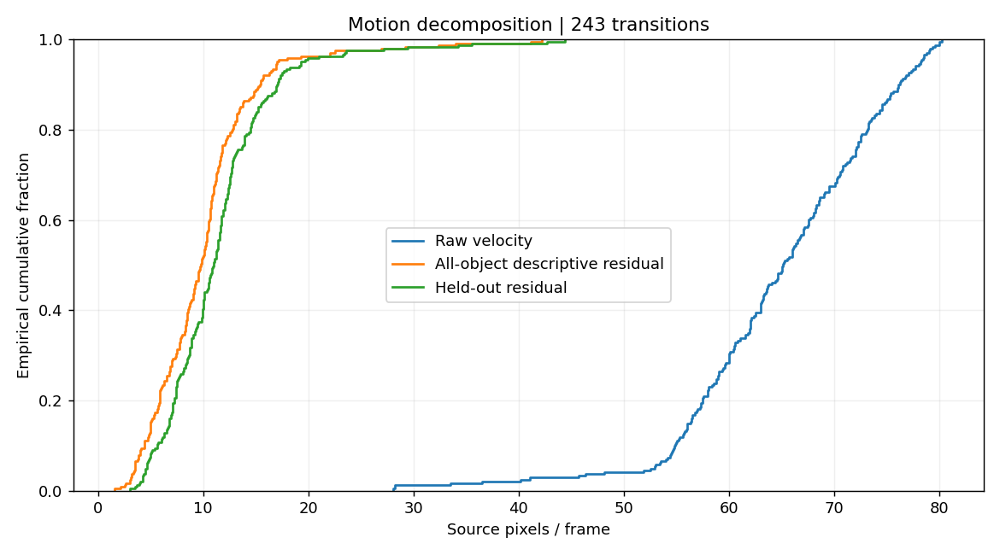
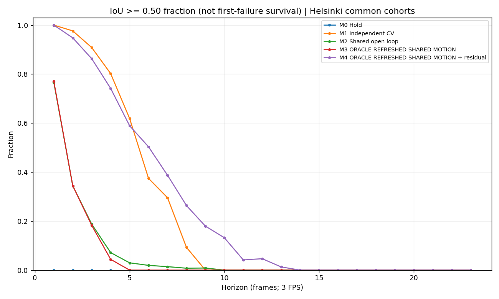
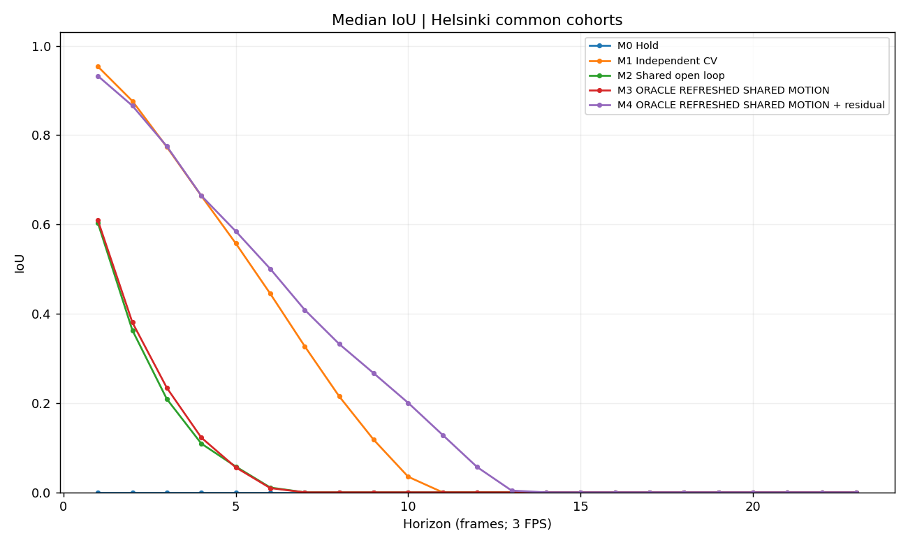
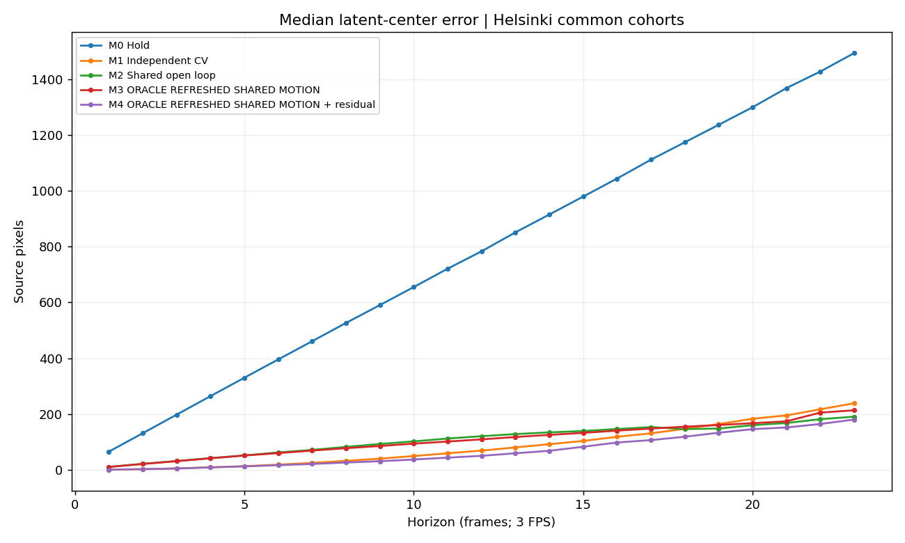
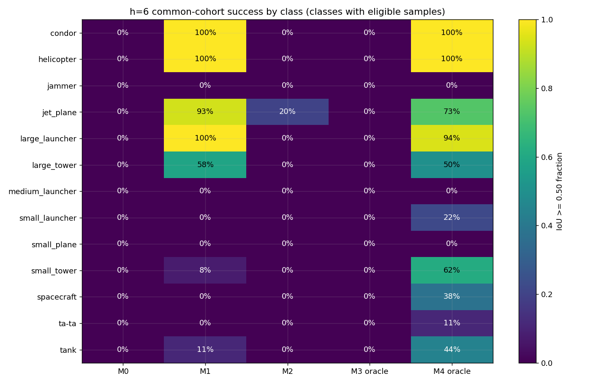
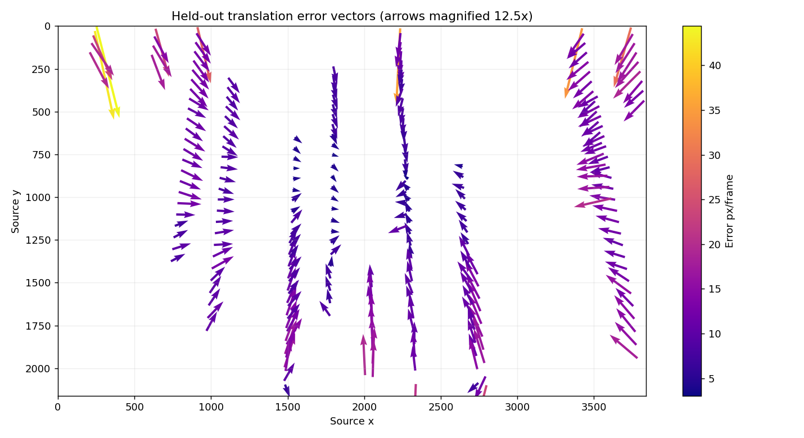
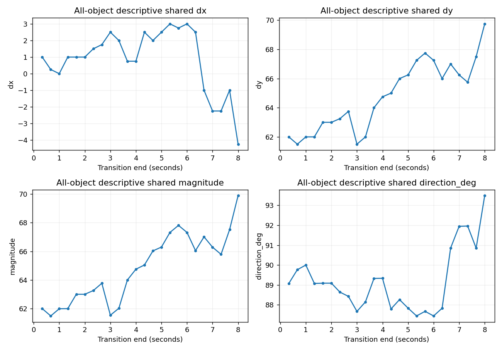
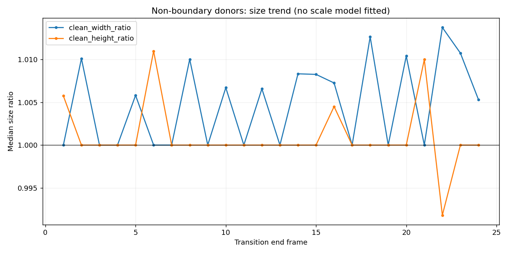

# Motion Oracle Experiment: translation, refresh and target residual

**Decision — DERIVED:** the shared-motion architecture hypothesis survives in a
qualified form. One translation captures the dominant displacement, but is not a
sufficient target propagation model. The oracle hybrid improves longer-horizon
overlap over independent CV, while losing some shorter-horizon successes. The next
experiment should be **GT-only leave-one-object-out similarity motion**, retaining
translation and CV controls. No image-based GMC or higher-DOF model was implemented
in this experiment; the next experiment has not started.

**MEASURED** denotes results computed here; **DERIVED** denotes their logical
implications; **HYPOTHESIS** denotes a candidate explanation/design; **UNKNOWN**
denotes something this experiment cannot establish. Every result is Helsinki-only.

## Scope, provenance and baseline gate

Work began with a clean checkout on `drone-targeted-solution-research`, HEAD
`bfed48e` (the merged Dataset & Scene Audit). The requested dedicated branch is
`drone-motion-architecture-experiments`. All new work is confined to this package.
The authoritative audit, official data, evaluator/probes and other challenges are
unchanged. No web research, image analysis, inference, training, production tracker,
camera policy, official validation attempt or merge into main was performed.

**MEASURED:** 25 frames, 3840x2160, 3 FPS, 259 annotations, 16 classes and 243
consecutive correspondences. Metadata specifies one physical instance per class;
class continuity is justified **only for Helsinki**. Mine roller has one transition
but no future target after two observations. Future disappearance is not evaluated.

**MEASURED:** the independent-CV gate exactly reproduces 227/227, 207/212, 179/197,
146/182, 104/168, 58/155 at h=1..6 and 0/117 at h=9. All **2,213 individual CV IoUs**
match the saved audit within 1e-12. This was checked before new-model comparisons.
The gate result is preserved in `baseline_reproduction.json`.

## Models and leakage boundary

| Model | Target information | Shared information | Size evolution |
| --- | --- | --- | --- |
| M0 HOLD | box at t | none | fixed |
| M1 INDEPENDENT CV | boxes at t-1,t | none | target width/height velocity |
| M2 SHARED OPEN LOOP | box at t | other-object median displacement at t-1 -> t | fixed |
| M3 ORACLE REFRESHED SHARED MOTION | box at t | other-object median on each future transition | fixed |
| M4 ORACLE REFRESHED SHARED MOTION + RESIDUAL | boxes at t-1,t | origin and each future other-object median | target width/height velocity |

M4 freezes `r_i = target_velocity(t) - shared_velocity(t)` and adds it to every
future shared displacement. **DERIVED:** if the shared term were held fixed,
shared + residual would algebraically equal independent CV. Refresh is the only
new center-motion information. A synthetic check verifies this equivalence.

Every donor list excludes the target entirely. The prediction API receives target
history ending at t and held-out donor updates; it has no future target argument.
Future target geometry enters only the scoring/stratification stage. M2 never
consumes a future donor update. **M3 and M4 use future other-object GT and are
ORACLE REFRESHED SHARED MOTION diagnostics**, optimistic information conditions
rather than guaranteed numerical upper bounds for every target. Real systems
would need to obtain this signal from images/background or other observations.
All methods also have perfect GT initialization, so none measures deployed AP.

Coordinate-wise median is the robust translation estimator. At least one donor is
required; no fallback uses target motion. Missing estimates/history are recorded,
not scored as fabricated predictions. State propagation uses latent centers;
output clipping to frame bounds follows the audit. Collapsed geometry scores zero.

## Shared motion magnitude, residuals and donor support

**MEASURED:** all-object decomposition below is descriptive (the target participates
in the descriptive shared vector). Predictive transfer uses separate held-out vectors.

| Quantity, source px/frame | N | Min | Median | Mean | P90 | Max |
| --- | ---: | ---: | ---: | ---: | ---: | ---: |
| Raw object speed | 243 | 28.071 | 65.115 | 64.779 | 76.081 | 80.264 |
| Shared translation magnitude | 24 | 61.501 | 64.901 | 64.802 | 67.450 | 69.879 |
| Residual after shared translation | 243 | 1.581 | 9.763 | 10.078 | 15.332 | 42.202 |
| Strict held-out translation residual | 243 | 3.052 | 11.011 | 11.443 | 17.007 | 44.402 |

The ratio of median descriptive residual magnitude to median raw magnitude is
**0.149931**. Removing shared motion reduces **uncentered squared motion energy by
96.9153%**, computed as `1 - sum(||residual||²)/sum(||raw||²)`.
It reduces pooled **centered vector variance by only 2.6918%**, computed using
`1 - trace(var(residual))/trace(var(raw))`. These are different quantities:
the large energy reduction reflects the common downward drift, not elimination
of 97% of the variation around that drift. Residuals of roughly 10 source pixels
per frame are consequential for the small boxes.

**MEASURED:** the 248 distinct held-out updates actually consumed by available
predictions have **7–11 donors, median 9**. Their coordinate MADs are:

| Dispersion statistic | Min | Median | Max |
| --- | ---: | ---: | ---: |
| MAD dx | 2.75 | 5.00 | 9.50 |
| MAD dy | 3.25 | 6.00 | 9.00 |
| Median Euclidean donor residual | 6.727 | 9.605 | 16.325 |

These MADs are unscaled median absolute deviations. The complete cache contains
384 held-out class/transition estimates, including targets absent at a transition;
its donor range is 7–12. Used-estimate and cache statistics therefore differ.
Minimum donor thresholds 1, 3 or 5 give the same observed predictions. Frame-0
open-loop estimates are unavailable because frame -1 does not exist, not because
an estimate was synthesized. The no-support behavior is separately tested.

## Fair cohorts and all-model results

**MEASURED:** all available GT origin/future combinations produce 2,456 candidate
pairs per model. Available totals are M0=2,456, M1=2,213, M2=2,270, M3=2,456,
M4=2,213. There are 12,280 saved rows including unavailable cases. The five-model
intersection has **2,213 pairs per model**, identical to the audit CV cohort.
Every claim comparing five models below uses this intersection.

At h=1, availability out of 243 candidate pairs is 243/227/232/243/227 for M0..M4.
At h=6 it is 168/155/158/168/155 out of 168. The availability and five-model tables
are separate; additional pairwise intersections are saved in
`pairwise_common_cohorts.csv` and are independently checked.

Each cell below is the count with **IoU >=0.50**. Divide by the shared N for the
success fraction; all common-cohort predictions are available.

| h | Seconds | N | M0 HOLD | M1 CV | M2 shared open | M3 oracle refreshed | M4 oracle + residual |
| ---: | ---: | ---: | ---: | ---: | ---: | ---: | ---: |
| 1 | 0.33 | 227 | 0 | 227 | 174 | 175 | 227 |
| 2 | 0.67 | 212 | 0 | 207 | 73 | 73 | 201 |
| 3 | 1.00 | 197 | 0 | 179 | 37 | 36 | 170 |
| 4 | 1.33 | 182 | 0 | 146 | 13 | 8 | 135 |
| 5 | 1.67 | 168 | 0 | 104 | 5 | 0 | 99 |
| 6 | 2.00 | 155 | 0 | 58 | 3 | 0 | 78 |
| 9 | 3.00 | 117 | 0 | 0 | 1 | 0 | 21 |
| 12 | 4.00 | 86 | 0 | 0 | 0 | 0 | 4 |
| 18 | 6.00 | 32 | 0 | 0 | 0 | 0 | 0 |
| 23 | 7.67 | 4 | 0 | 0 | 0 | 0 | 0 |

Every horizon through h=23 is in `common_cohort_summary.csv`; model-specific
eligibility continues to h=24 in `horizon_summary.csv`. Both contain valid count,
valid fraction, mean/median IoU and error diagnostics for every model/horizon.
Long horizons change class/origin composition; this is not independent survival
sampling or a statistical significance result.

**MEASURED at h=6**, all on N=155:

| Model | Success fraction | Mean IoU | Median IoU | Median center error px | Median error / GT short side | Mean absolute W/H error px |
| --- | ---: | ---: | ---: | ---: | ---: | ---: |
| M0 | 0.00% | 0.0000 | 0.0000 | 395.865 | 7.585 | 4.613 / 4.232 |
| M1 | 37.42% | 0.4139 | 0.4448 | 19.235 | 0.385 | 4.961 / 10.710 |
| M2 | 1.94% | 0.1006 | 0.0108 | 62.964 | 1.148 | 4.613 / 4.232 |
| M3 | 0.00% | 0.0976 | 0.0095 | 60.531 | 1.151 | 4.613 / 4.232 |
| M4 | 50.32% | 0.4608 | 0.5004 | 17.241 | 0.325 | 4.961 / 10.710 |

**DERIVED:** translation-only open loop decays quickly: 76.65% at h=1, 34.43% at
h=2, 18.78% at h=3, 1.94% at h=6. Refresh alone does not repair the missing spatial
residual: M3 is 77.09%, 34.43%, 18.27%, and 0% at those horizons. The residual
materially improves refreshed prediction, but this M3-to-M4 comparison also adds
target size velocity. It does not isolate center residual from size extrapolation.
M1 and M4 use identical size velocity, so their comparison isolates center refresh.

**MEASURED:** M4 loses to CV at h=2..5, ties at h=1, and wins in aggregate at h=6..13.
At h=6, M4 gains 27 CV failures but loses 7 CV successes: net +20/155, or **12.90
percentage points**. At h=3 it gains 4 and loses 13 (net -9/197). At h=9 it gains
21/117 (17.95 points) from a zero CV baseline. M4's last nonzero horizon is h=13
(1/77); all methods have zero successes at h=14..23. This is limited extension,
not a solved long-term propagation problem.

## Per-class, size and boundary effects

**MEASURED at h=6:** counts for M1 -> M4 on identical per-class cases are:

| Class | N | CV | Oracle hybrid |
| --- | ---: | ---: | ---: |
| condor | 4 | 4 | 4 |
| helicopter | 12 | 12 | 12 |
| jammer | 6 | 0 | 0 |
| jet_plane | 15 | 14 | 11 |
| large_launcher | 18 | 18 | 17 |
| large_tower | 12 | 7 | 6 |
| medium_launcher | 3 | 0 | 0 |
| small_launcher | 18 | 0 | 4 |
| small_plane | 2 | 0 | 0 |
| small_tower | 13 | 1 | 8 |
| spacecraft | 16 | 0 | 6 |
| ta-ta | 18 | 0 | 2 |
| tank | 18 | 2 | 8 |

Hangar, medium plane and mine roller have no eligible h=6 common cases. All model
IoU means/medians and success fractions by class and horizon are in
`per_class_summary.csv`. The hybrid's gains and losses are not uniform by class.

**MEASURED:** origin size bins use audit L0 short side = source short side / 4.
At h=6, M1 -> M4 successes are **0/36 -> 6/36** for 4–<8, **10/70 -> 28/70** for
8–<16, **44/45 -> 40/45** for 16–32, and **4/4 -> 4/4** above 32 pixels. No origin
in the <4 bin qualifies at h=6. M2 has 3/45 in 16–32 and zero in the other bins;
M0/M3 have zero everywhere. Small targets remain difficult despite hybrid gains.
**UNKNOWN:** causal effects of size separate from class, position and trajectory.

**MEASURED:** boundary contact at t-1, t or evaluation frame yields 17 boundary
cases at h=6: CV and hybrid both succeed in 8/17. On the other 138 cases, CV is
50/138 and hybrid 70/138. At h=3, boundary success is 15/22 versus 14/22, and
non-boundary success is 164/175 versus 156/175. Thus the h=6 benefit is not confined
to boundary cases. Boundary and non-boundary cohorts differ in class/size; the
higher boundary fraction at h=6 is not evidence that clipping helps tracking.

## Held-out spatial transfer and temporal shared motion

**MEASURED:** all **243** held-out one-step targets give **182/243 = 74.90%** IoU
success, median IoU **0.6083**, median center error **11.011 px**, P90 **17.007 px**.
This is the full LOO transfer diagnostic, including targets with no velocity history;
the smaller five-model h=1 M3 result is 175/227. Excluding boundary transitions
leaves 172/220 successes (78.18%). Elsewhere-in-scene motion transfers substantially,
but misses roughly a quarter of boxes even with perfect other-object GT.

Errors are spatially structured. Left/right image halves give 69/115 and 113/128
successes, but median center errors 9.552 and 11.792 px respectively; IoU also
depends on target size. Upper/lower halves give 92/129 and 90/114, median errors
11.236 and 10.767 px. These are descriptive strata, not spatially independent tests.
The correlation of x with signed predicted-minus-true dx error is **-0.9648**;
y with signed dy error is **-0.8206**. On 220 non-boundary transitions these remain
**-0.9647 and -0.9626**. Spatial residual structure persists without edge clipping.
No transform was fitted to obtain these correlations; class and time are confounded.

**MEASURED:** all-object shared dx spans **-4.25 to 3.00 px/frame**, dy **61.50 to
69.75**, direction **87.446 to 93.487 degrees** in image coordinates. First-to-last
shared vectors are (1.00,62.00) and (-4.25,69.75). The shared vector changes, but the
donor set also changes as objects enter and leave. **UNKNOWN:** how much of this
change reflects camera dynamics versus the median of changing spatial support.
An oracle GT median is not automatically a physical camera translation.

## Scale evidence and next experiment

**MEASURED:** for 220 non-boundary object transitions, width ratio has median 1.0,
mean 1.00807, P90 1.02278, range 0.95455–1.05000. Height ratio has median 1.0,
mean 1.00173, P90 1.02083, range 0.93333–1.05882. Across the 24 per-transition
non-boundary donor medians, width ratio has median **1.00557**, range 1–1.01375;
height ratio has median **1.00000**, range 0.99180–1.01099. Median within-transition
ratio MAD is 0.00557 for width and 0.00675 for height. Per-class values are saved.

**DERIVED:** observed size change is modest per frame and heterogeneous; horizontal
growth has some shared tendency, but the measurements do not establish one coherent
isotropic scale factor. Integer box quantization and target-specific shape/viewpoint
effects also matter. The stronger evidence for richer geometry is the systematic
position-dependent center residual, not a claim that bbox widths prove similarity.

**HYPOTHESIS / exact recommended next experiment:** use the same annotation-only,
strict leave-one-object-out protocol to compare refreshed **similarity** against
refreshed translation and independent CV. Fit each similarity only to other-object
centers on that transition, require adequate nondegenerate spatial donor support,
report unavailable cases, retain common cohorts, and evaluate h=1..6 plus longer
supported horizons. First isolate center transport with a matched size policy;
then report a separate scale-based size update ablation. Include an oracle residual
variant with an explicit residual coordinate convention, and stratify boundaries.
Measure whether held-out spatial error and IoU improve, not donor fit quality.
Only if systematic anisotropic residual remains should a separate affine comparison
follow. Do not jump directly to a homography or production tracker.

**DERIVED:** the evidence is strong enough to justify a later image-based GMC
feasibility experiment, but translation-only GMC is an inadequate sole propagation
model here. Resolve the GT-only spatial model next so an image experiment has a
measured geometric target. **UNKNOWN:** whether real image estimates will preserve
the oracle gain, particularly under crops, latency, noisy boxes and changing donors.

## Validation and limits

**MEASURED / PASS:** independent scalar reconstruction checks all 12,280 rows,
2,213 common keys, 2,510 grouped summaries, 408 donor estimates and 243 LOO cases.
All 2,213 CV rows match the audit. Future-target poisoning checks 243 origins;
no-support and fixed-shared-hybrid-equals-CV tests pass. Supplementary validation
checks all 231 pairwise cohort rows, 243 decomposition rows and reported donor/
spatial diagnostics. Thirty input hashes are unchanged. Eight figures were generated
and visually inspected. Exact check outputs are saved in the validation JSON files.

**UNKNOWN / limitations:** one flight, 16 physical objects, 25 correlated frames,
perfect boxes/correspondence, no actual target masking or image observation process,
future donor GT for the oracle models, changing class/spatial support, and no scoring
after target disappearance. Apparent camera motion cannot be separated from world
object motion using these annotations alone. No population-level significance,
hidden-scene generalization, detector accuracy, AP, runtime feasibility or production
architecture claim follows. The recommended next experiment is a test, not a
selection of similarity, affine or any named tracker.
