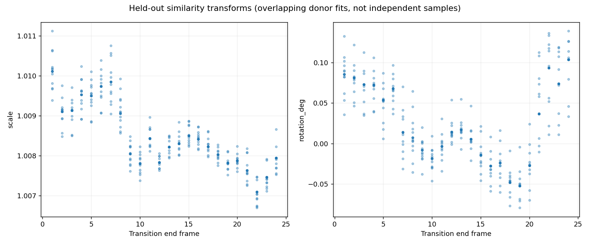
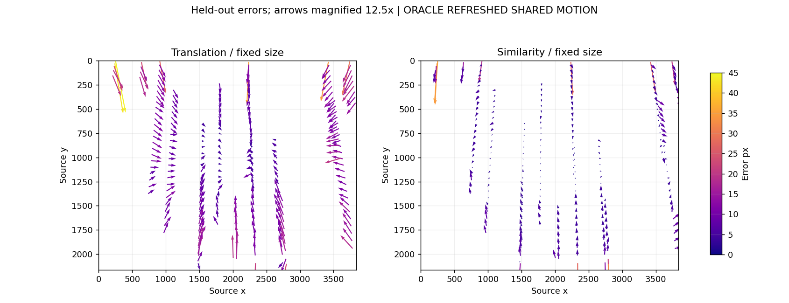
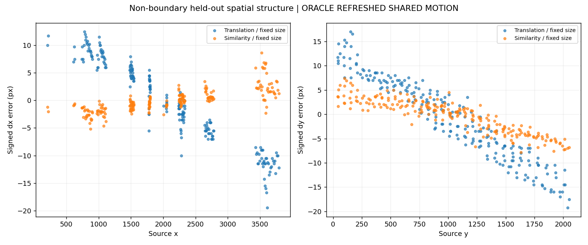
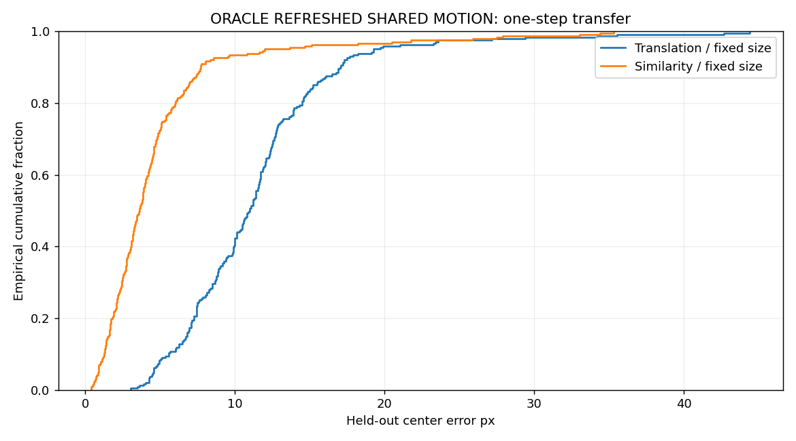
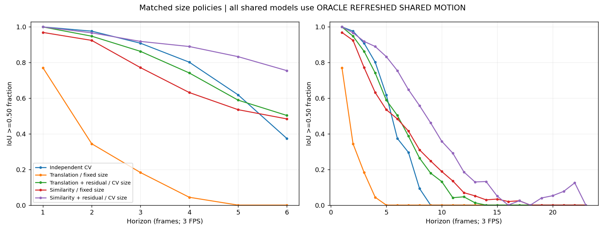
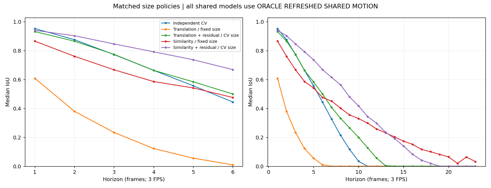
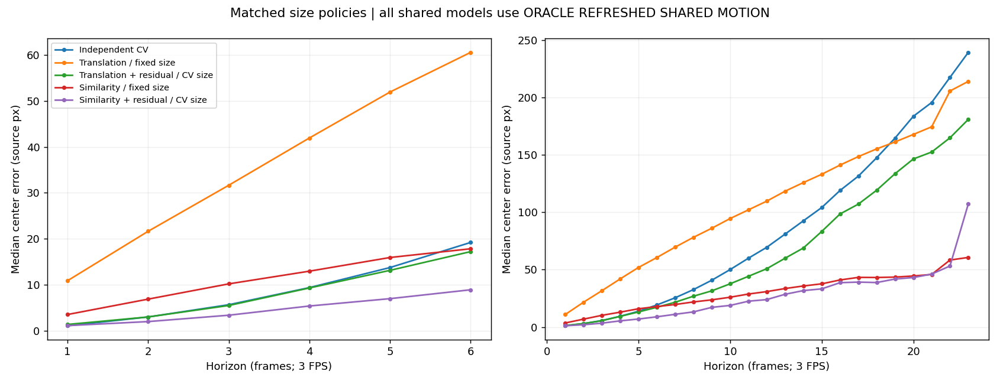
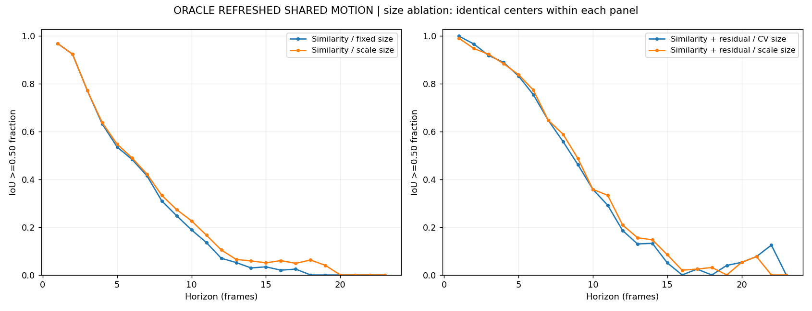
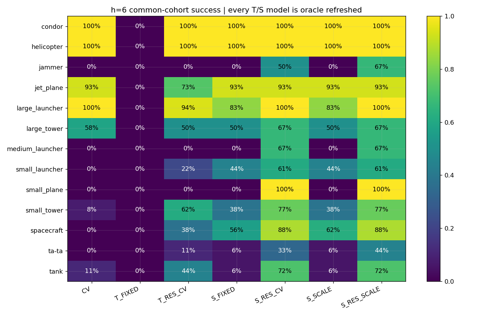

# GT-only strict leave-one-object-out similarity motion

**DERIVED — decision:** similarity materially improves held-out spatial transfer
and the h=3–6 prediction tradeoff, especially with a frozen target residual. It
reduces the magnitude of position-dependent error but does **not** remove that
structure. The next experiment should be a separate **GT-only strict leave-one-
object-out affine comparison**, with matched size policies and the same controls.
Affine has not been implemented here. The shared geometric hypothesis is strong
enough to justify later image-derived GMC work, but image feasibility is untested.

**MEASURED** means directly computed; **DERIVED** means an implication of those
measurements; **HYPOTHESIS** marks a candidate explanation/design; **UNKNOWN** marks
what remains unestablished. All conclusions are Helsinki-specific. No significance
claim or generalization to a population of flights is made.

## Preservation and controls

Work continued on `drone-motion-architecture-experiments` from clean HEAD
`d1d195b` (`Add Drone Flyby oracle motion decomposition experiment`). All new files
are inside `motion_similarity_oracle/`. SHA-256 checks preserve all **34 tracked
translation-experiment artifacts**, plus 25 annotation files and source metadata.
No reviewed artifact was rewritten, no previous script was executed, and no image,
evaluator, detector, training, affine, homography or production-tracker work ran.

**MEASURED:** all three required controls match the prior package across **2,456
candidate rows each**, including availability. The largest difference in raw bbox
coordinates is **0.0**. Available-row IoUs agree within 1e-12. Independent validation
also checks the controls and the original CV gate: 227/227, 207/212, 179/197,
146/182, 104/168, 58/155 at h=1..6, and 0/117 at h=9.

The source has 25 frames, 259 annotations, 243 consecutive correspondences and
one physical instance for each of 16 classes, explicitly established by metadata.
Class continuity remains a **Helsinki-only** correspondence assumption.

## Similarity fit, residual convention and fair size policies

The fitted orientation-preserving transform is

`F_k(p) = [[a,-b],[b,a]] p + [tx,ty]`,

with scale `sqrt(a²+b²)` and image-coordinate rotation `atan2(b,a)`. Translation,
rotation and uniform scale are allowed; reflection, anisotropic scale and shear
are not. Each fit uses **only other classes present at both transition endpoints**.
The target's past and future coordinates are absent from the fit arrays.

The deterministic robust estimator uses Huber IRLS, delta **3 source pixels**,
**20 fixed reweighting steps** and a final weighted solve. Initial weights are one;
subsequent weights are `min(1,3/residual_norm)`. Coefficients use weighted centered
least squares. All donor identities, weights and residuals are recorded. Parameters
were fixed before held-out evaluation; there was no target-dependent tuning.

Support requires **>=3 donors**, RMS spread **>=100 px**, minor-axis spread **>=25
px**, and covariance eigenvalue ratio **>=0.001**. Final weighted support must
satisfy the same criteria and effective donor N **>=3**. Spread is computed in
source positions before each transition. These are conservative coverage checks,
not a claim that three non-collinear points are mathematically necessary to solve
a similarity. Insufficient/degenerate fits are unavailable, without a fallback.

| ID | Center transport | Width/height policy |
| --- | --- | --- |
| CV | exact target t-1,t constant velocity | target size CV |
| T_FIXED | refreshed held-out median translation | fixed at origin |
| T_RES_CV | refreshed translation + frozen target residual | target size CV |
| S_FIXED | refreshed held-out similarity | fixed at origin |
| S_RES_CV | refreshed similarity + frozen target residual | target size CV |
| S_SCALE | exactly S_FIXED's center | origin size x product of future scales |
| S_RES_SCALE | exactly S_RES_CV's center | origin size x product of future scales |

**Every T/S model is ORACLE REFRESHED SHARED MOTION.** Other-object future GT supplies
future updates; future target GT is only used for evaluation. Even CV is perfectly
GT-initialized. None of these curves measures deployed tracking accuracy or AP.

For similarity, the frozen residual is `r_i = c_i(t) - F_t(c_i(t-1))`. Prediction
uses `c_hat(k) = F_k(c_hat(k-1)) + r_i`. The residual is added unchanged in fixed
image-axis pixels each step; there is no separate rotation/scale transport of the
residual state. This choice is explicit and not uniquely established by this test.
The translation version reduces exactly to the previous velocity-minus-shared
residual. Fixed translation + residual collapses to CV; iterating a fixed similarity
generally does not, because it acts on changing positions. This experiment does not
separate the contribution of rotation from uniform scale or test open-loop similarity.

**Fair center comparisons:** T_FIXED vs S_FIXED uses identical fixed dimensions;
T_RES_CV vs S_RES_CV vs CV uses identical target size CV. The validator checks the
predicted dimensions directly. The scale-size ablation changes dimensions only:
S_SCALE vs S_FIXED and S_RES_SCALE vs S_RES_CV have identical predicted centers.
Scale replaces target size CV in S_RES_SCALE. No rotation-induced axis-aligned
bounding-box enlargement is added.

Geometry follows the reviewed experiment: continuous xyxy, no +1, 3840x2160 output
clipping, collapsed boxes score zero, and latent centers/sizes are not recursively
clipped. Center errors compare latent prediction against GT; clipped-center errors
are also retained. All time conversions use 3 FPS.

## Donor support and transform behavior

**MEASURED:** all **384** cached target/transition fits are sufficient; zero fail
the support checks. The **243** distinct fits actually consumed by predictions have:

| Statistic | Min | Median | Max |
| --- | ---: | ---: | ---: |
| Donor count | 7 | 9 | 11 |
| RMS spatial spread, px | 803.743 | 1080.506 | 1597.208 |
| Minor-axis spread, px | 333.422 | 552.798 | 709.047 |
| Covariance eigenvalue ratio | 0.1119 | 0.3141 | 0.8281 |
| Effective donor N | 6.488 | 8.786 | 10.717 |
| Median donor fit residual, px | 1.316 | 2.429 | 6.340 |
| RMS donor fit residual, px | 1.951 | 3.541 | 12.477 |
| Scale per transition | 1.006698 | 1.008352 | 1.011118 |
| Rotation per transition, degrees | -0.07943 | 0.01418 | 0.13882 |

The cache includes fits for targets not present at a transition; only used-fit
statistics are quoted above. Fit quality is recorded for diagnosis, **not used as
the criterion for choosing a model**. The held-out metrics below determine the
conclusion. Degenerate behavior was tested on synthetic cases because Helsinki
never approaches the specified support thresholds.

## One-step spatial transfer: substantial improvement, remaining structure

This test holds out each of the **243 target transitions**, including targets with
no previous velocity history. Sizes are fixed for both main compared models.

| Cohort/model | Success / N | Success fraction | Median IoU | Median center px | Mean center px | P90 center px |
| --- | ---: | ---: | ---: | ---: | ---: | ---: |
| All / translation | 182/243 | 74.90% | 0.6083 | 11.011 | 11.443 | 17.007 |
| All / similarity | 230/243 | 94.65% | 0.8600 | 3.621 | 4.788 | 7.701 |
| Non-boundary / translation | 172/220 | 78.18% | 0.6099 | 10.571 | 10.464 | 15.522 |
| Non-boundary / similarity | 216/220 | 98.18% | 0.8658 | 3.329 | 3.544 | 6.446 |

**MEASURED:** one-step fixed-size similarity gains **48/243**, or **19.75 percentage
points**, and reduces median center error by **67.12%**. On non-boundary transitions
the gain is 44/220 (20 points), with a **68.51%** reduction in median center error.
The same one-step scale-size model has identical success counts (230 and 216).

**MEASURED — spatial residual structure:** correlations use origin position versus
signed predicted-minus-true center displacement error. Removing boundary transitions
reproduces the previous approximately -0.965/-0.963 translation result.

| Non-boundary diagnostic, N=220 | Translation | Similarity |
| --- | ---: | ---: |
| corr(x, signed dx error) | -0.964663 | +0.775405 |
| corr(y, signed dy error) | -0.962612 | -0.902787 |
| x correlation after within-transition centering | -0.992583 | +0.776714 |
| y correlation after within-transition centering | -0.993008 | -0.919070 |
| x-error slope, px per 1000 source x pixels | -7.6236 | +1.7427 |
| y-error slope, px per 1000 source y pixels | -14.3055 | -5.5807 |
| RMS signed x error, px | 7.3869 | 2.1015 |
| RMS signed y error, px | 8.2762 | 3.4341 |

All-transition similarity correlations are +0.785630 for x and -0.510134 for y;
boundary clipping substantially affects the pooled y statistic. The cleaner
non-boundary analysis therefore matters. Univariate slopes are descriptive
diagnostics, **not an affine transform fit**.

**DERIVED:** similarity sharply reduces error amplitude, but the spatial structure
persists, including after removing between-transition means. The horizontal sign
reversal and still-negative vertical slope are consistent with a uniform-scale
compromise that over-transports x and under-transports y in parts of the image.
**HYPOTHESIS:** anisotropic/projected scene geometry may explain the remainder.
This is not proof that an affine model will generalize, nor a causal camera model;
class, location, annotation behavior and time still overlap in one flight.

## Common-cohort prediction comparison

There are 2,456 candidate origin/future pairs per model, producing **17,192 rows**.
CV, T_RES_CV, S_RES_CV and S_RES_SCALE are available on 2,213 pairs each; pure shared
models are available on all 2,456. Missing cases require unavailable target t-1
history; no actual case is missing due to donor support. The seven-model common
intersection is **2,213 keys**, or **15,491 rows**. All comparisons in this section
use identical keys, not the easier single-observation cohorts.

Each table cell is the **success count with IoU >=0.50**, divided by the shared N
to obtain a fraction. T/S columns always use ORACLE REFRESHED SHARED MOTION.

| h | N | CV | T_FIXED | S_FIXED | T_RES_CV | S_RES_CV | S_SCALE | S_RES_SCALE |
| ---: | ---: | ---: | ---: | ---: | ---: | ---: | ---: | ---: |
| 1 | 227 | 227 | 175 | 220 | 227 | 227 | 220 | 225 |
| 2 | 212 | 207 | 73 | 196 | 201 | 205 | 196 | 201 |
| 3 | 197 | 179 | 36 | 152 | 170 | 181 | 152 | 182 |
| 4 | 182 | 146 | 8 | 115 | 135 | 162 | 116 | 161 |
| 5 | 168 | 104 | 0 | 90 | 99 | 140 | 92 | 141 |
| 6 | 155 | 58 | 0 | 75 | 78 | 117 | 76 | 120 |
| 9 | 117 | 0 | 0 | 29 | 21 | 54 | 32 | 57 |
| 12 | 86 | 0 | 0 | 6 | 4 | 16 | 9 | 18 |

The common-cohort h=1 S_FIXED count is 220/227; the separate all-transition spatial
test above is 230/243. Those denominators must not be conflated. All horizons h=1..23
and all model means/medians are in [MEASUREMENTS.md](MEASUREMENTS.md) and the summary
CSVs. All-origin model availability extends to h=24. Curves are per-horizon success,
not consecutive-first-failure survival. Late cohorts are small and change composition;
for example, S_RES_CV has 0/50 at h=16 but 1/41 at h=17, not recovery of a fixed cohort.

**MEASURED at h=6 (2 seconds), N=155:**

| Model | Success % | Mean IoU | Median IoU | Median center px | Median center / GT short side |
| --- | ---: | ---: | ---: | ---: | ---: |
| CV | 37.42 | 0.4139 | 0.4448 | 19.235 | 0.3854 |
| T_FIXED | 0.00 | 0.0976 | 0.0095 | 60.531 | 1.1506 |
| S_FIXED | 48.39 | 0.4629 | 0.4760 | 17.858 | 0.3442 |
| T_RES_CV | 50.32 | 0.4608 | 0.5004 | 17.241 | 0.3245 |
| S_RES_CV | 75.48 | 0.6257 | 0.6691 | 8.946 | 0.1836 |
| S_SCALE | 49.03 | 0.4717 | 0.4844 | 17.858 | 0.3442 |
| S_RES_SCALE | 77.42 | 0.6383 | 0.6936 | 8.946 | 0.1836 |

**DERIVED:** matched-size similarity improves pure shared transport substantially,
but does not replace target-specific information. The residual hybrid improves the
h=2..6 tradeoff over the previous hybrid at every one of those horizons. Against
CV, it loses 2 successes at h=2 (205 vs 207), then gains 2, 16, 36 and 59 at h=3..6.
At h=6, that is **+38.06 points versus CV** and **+25.16 points versus the previous
hybrid**. Pairwise counts show 61 CV failures gained and 2 CV successes lost;
relative to the previous hybrid, 42 are gained and 3 lost. The benefit is not
caused by a size-policy change, because these three models use identical sizes.

## Scale-size ablation: modest benefit with short-horizon losses

**MEASURED:** S_SCALE versus S_FIXED has the same success counts at h=1..3, then
gains 1/182, 2/168 and 1/155 at h=4..6. At h=9 the gain is 3/117. This is a modest
overlap gain compared with the much larger center-transport improvement.

For the residual hybrid, scale sizes versus target size CV give success deltas
**-2, -4, +1, -1, +1, +3** at h=1..6. At h=6, 4 cases improve across threshold
while 1 worsens, producing 120/155 instead of 117/155. At h=2 all four lost cases
are in the boundary-contact stratum: 15/23 versus 19/23; the non-boundary count
stays 186/189. Uniform scale does not reproduce nonlinear clipped-box size changes.

Mean absolute width/height errors at h=6 are **4.613/4.232 px** for fixed size,
**4.961/10.710 px** for target size CV and **2.552/4.527 px** for similarity scale
size. Scale helps width error and the CV-height extrapolation problem, but slightly
worsens height error relative to fixed size. **DERIVED:** scale updating helps some
cohorts/horizons; it is not an unconditional replacement for a target size model.

## Class, size and boundary effects

**MEASURED h=6 successes on matched per-class cohorts:**

| Class | N | CV | Translation residual | Similarity residual, CV size | Similarity residual, scale size |
| --- | ---: | ---: | ---: | ---: | ---: |
| condor | 4 | 4 | 4 | 4 | 4 |
| helicopter | 12 | 12 | 12 | 12 | 12 |
| jammer | 6 | 0 | 0 | 3 | 4 |
| jet_plane | 15 | 14 | 11 | 14 | 14 |
| large_launcher | 18 | 18 | 17 | 18 | 18 |
| large_tower | 12 | 7 | 6 | 8 | 8 |
| medium_launcher | 3 | 0 | 0 | 2 | 2 |
| small_launcher | 18 | 0 | 4 | 11 | 11 |
| small_plane | 2 | 0 | 0 | 2 | 2 |
| small_tower | 13 | 1 | 8 | 10 | 10 |
| spacecraft | 16 | 0 | 6 | 14 | 14 |
| ta-ta | 18 | 0 | 2 | 6 | 8 |
| tank | 18 | 2 | 8 | 13 | 13 |

No class has fewer aggregate h=6 successes under S_RES_CV than under CV or the old
hybrid, although individual previously successful cases can fail. Hangar, medium
plane and mine roller have no h=6 common sample. Mine roller has no common sample
at any horizon, but remains in the 243-transition one-step transfer test.

**MEASURED size effects:** h=6 L0 origin-short-side bins give CV / T_RES_CV /
S_RES_CV / S_RES_SCALE counts of **0/6/17/19 out of 36** in 4–<8 pixels and
**10/28/52/53 out of 70** in 8–<16. In 16–32 they are **44/40/44/44 out of 45**;
above 32 all are **4/4**. There are no <4 origins in this horizon's common cohort.
The similarity hybrid recovers much of the small-object deficit, but ta-ta and
small launcher remain far from perfect at two seconds. Size is confounded with
class/position; this is not a causal size experiment.

**MEASURED boundary effects:** at h=6, CV / T_RES_CV / S_RES_CV / S_RES_SCALE are
**8/8/11/11 out of 17 boundary-contact cases**, versus **50/70/106/109 out of 138
non-boundary cases**. The gains are not restricted to truncation. Boundary flags
include t-1, origin and evaluated target; one-step spatial flags include only the
two transition endpoints. These are diagnostic evaluation labels, never features.

## Decision and exact next step

1. **Does similarity improve one-step transfer? MEASURED: yes.** Fixed-size success
   rises 74.90% -> 94.65% over all 243 targets; median center error falls 67.12%.
2. **Does it remove location-dependent residuals? MEASURED: no.** Error amplitude
   drops, but non-boundary correlations remain +0.775/-0.903, with a vertical
   slope of -5.581 error pixels per 1000 image pixels. Within-transition analysis
   confirms the remaining structure is not solely a between-frame artifact.
3. **Does similarity + residual improve h=2–6? MEASURED: qualified yes.** It beats
   the previous hybrid at each horizon, and CV at h=3..6, but loses 2/212 versus
   CV at h=2. At h=6 the matched-size gain over CV is 59/155.
4. **Does scale updating help? MEASURED: mixed.** Small longer-horizon gains come
   with short-horizon/boundary losses. Keep it as an explicit ablation.
5. **Is similarity sufficient? DERIVED: not as a complete shared spatial model.**
   It is a useful stronger baseline, but material, systematic held-out errors remain.
6. **Is affine justified next? DERIVED: yes, as an experiment.** The unequal signed
   x/y residual trends motivate testing anisotropic geometry; donor fit alone would
   not establish the value of additional degrees of freedom.
7. **Is later image-derived GMC justified? DERIVED: yes.** Repeated held-out oracle
   gains establish geometric opportunity. **UNKNOWN:** whether images, crops,
   noisy detections or runtime constraints can supply transforms of this quality.

**HYPOTHESIS / next experiment:** create a separate **GT-only strict LOO affine
oracle** package, keeping CV and these similarity/translation controls. Require
adequate spatial donor coverage and numerically stable, invertible fitted updates;
record missing cases rather than hiding them behind fallbacks. First compare center
transport with fixed dimensions and compare residual models with identical target
size CV. Use the same image-axis residual convention, held-out one-step spatial
diagnostics, h=1..6 common cohorts and boundary/size/class strata. Test whether affine
reduces the remaining non-boundary x/y structure **and improves held-out IoU**, then
report size-policy effects separately. Freeze estimator settings before evaluation.
Do not choose affine merely because it fits donors better. This next experiment
has not been started; image-derived GMC, homography and tracking remain unimplemented.

## Independent validation and limits

**PASS:** scalar analytic IRLS independently reconstructs all **384 transforms**,
including final weights and support measures. A separate IoU implementation checks
all **17,192 rows**; **2,213 common keys**, **3,514 grouped summaries**, **486 pairwise
cohort rows**, and **729 one-step rows** are verified. All **7,368 control rows**
match prior results. Matched dimensions and identical ablation centers are checked
directly. Removing/poisoning the entire target trajectory in **16 class checks**
leaves donor transforms unchanged; **243 origin checks** provide only permissible
target history and reproduce saved predictions. Future target-history injection
is rejected. Known-transform, too-few, coincident, collinear, near-collinear,
collapsed-transform and no-donor fixtures pass. Eight supplementary spatial slopes
are independently checked. All **60 preservation hashes** remain unchanged.
Nine figures were generated and visually inspected.

**UNKNOWN / limits:** one flight, one instance per class, correlated samples,
GT initialization and other-object future GT, fixed robust-fit settings, no noisy
feature correspondence, no actual crop visibility or latency process, changing
donor composition, boundary-altered centers, and no evaluation after disappearance.
Rotation and scale contributions were not separated. Residual coordinate choices
and donor-support thresholds were not optimized or validated across flights.
The robust median translation and Huber similarity are specific estimators; these
results do not exhaust all translation/similarity estimators. Camera motion cannot
be causally separated from scene/object motion using these annotations alone.
No population-level significance, hidden-data accuracy, deployed AP, or final
production architecture follows from this experiment.
