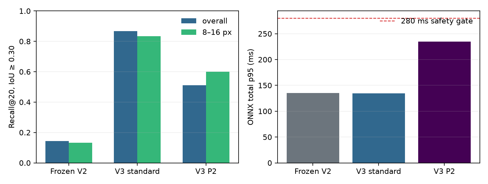

# V3 one-class appearance discovery

## Decision

**Selected appearance proposer:** v3_standard.  
**Reason:** standard one-class YOLO11n passed every gate, ranked held-out targets substantially better than both controls, preserved native sanity performance, exported exactly, and was faster than P2.  
**Exactly one next action:** Integrate the selected V3 appearance proposer into the frozen V2 pipeline.

## Experiment identity

- Branch: `drone-v3-oneclass-discovery`
- Input commit SHA: `5b7caf09188c3020515e80d9f3378560e817f9e6`
- Dataset size: 205 image groups recorded as `{'native_eval:native': 6, 'synthetic_eval:synthetic': 90, 'train:native': 19, 'train:synthetic': 90}`
- Background split: train hosted frames 0–145; evaluation hosted frames 150–245 (5-frame sampling, contiguous held-out time block).
- Target-view split: Helsinki frames 0–18 train, 19–24 evaluation. These are views of the same physical instances, not instance generalization.

## Recall@K

All figures are discovery recall at the fixed diagnostic floor, after score ranking and NMS.

| Model | Benchmark | Size | R@1/.30 | R@5/.30 | R@20/.30 | R@1/.50 | R@5/.50 | R@20/.50 | R@8/.30 | R@16/.30 | R@32/.30 |
|---|---|---:|---:|---:|---:|---:|---:|---:|---:|---:|---:|
| frozen_v2 | native_eval | lt8 | 0.000 | 0.000 | 0.000 | 0.000 | 0.000 | 0.000 | 0.000 | 0.000 | 0.000 |
| frozen_v2 | native_eval | 8to16 | 0.043 | 0.304 | 0.478 | 0.043 | 0.304 | 0.435 | 0.391 | 0.391 | 0.478 |
| frozen_v2 | native_eval | gt16 | 0.312 | 0.875 | 1.000 | 0.312 | 0.875 | 1.000 | 1.000 | 1.000 | 1.000 |
| frozen_v2 | native_eval | overall | 0.105 | 0.368 | 0.474 | 0.105 | 0.368 | 0.456 | 0.439 | 0.439 | 0.474 |
| frozen_v2 | synthetic_eval | lt8 | 0.000 | 0.000 | 0.000 | 0.000 | 0.000 | 0.000 | 0.000 | 0.000 | 0.033 |
| frozen_v2 | synthetic_eval | 8to16 | 0.100 | 0.133 | 0.133 | 0.067 | 0.100 | 0.100 | 0.133 | 0.133 | 0.133 |
| frozen_v2 | synthetic_eval | gt16 | 0.233 | 0.233 | 0.300 | 0.200 | 0.200 | 0.267 | 0.267 | 0.300 | 0.333 |
| frozen_v2 | synthetic_eval | overall | 0.111 | 0.122 | 0.144 | 0.089 | 0.100 | 0.122 | 0.133 | 0.144 | 0.167 |
| v3_p2 | native_eval | lt8 | 0.000 | 0.000 | 0.000 | 0.000 | 0.000 | 0.000 | 0.000 | 0.000 | 0.000 |
| v3_p2 | native_eval | 8to16 | 0.043 | 0.087 | 0.217 | 0.000 | 0.000 | 0.000 | 0.174 | 0.174 | 0.217 |
| v3_p2 | native_eval | gt16 | 0.188 | 0.500 | 0.750 | 0.125 | 0.312 | 0.625 | 0.625 | 0.750 | 0.750 |
| v3_p2 | native_eval | overall | 0.070 | 0.175 | 0.298 | 0.035 | 0.088 | 0.175 | 0.246 | 0.281 | 0.298 |
| v3_p2 | synthetic_eval | lt8 | 0.000 | 0.033 | 0.033 | 0.000 | 0.000 | 0.000 | 0.033 | 0.033 | 0.033 |
| v3_p2 | synthetic_eval | 8to16 | 0.400 | 0.567 | 0.600 | 0.300 | 0.367 | 0.367 | 0.567 | 0.600 | 0.633 |
| v3_p2 | synthetic_eval | gt16 | 0.800 | 0.900 | 0.900 | 0.533 | 0.700 | 0.733 | 0.900 | 0.900 | 0.900 |
| v3_p2 | synthetic_eval | overall | 0.400 | 0.500 | 0.511 | 0.278 | 0.356 | 0.367 | 0.500 | 0.511 | 0.522 |
| v3_standard | native_eval | lt8 | 0.000 | 0.000 | 0.000 | 0.000 | 0.000 | 0.000 | 0.000 | 0.000 | 0.111 |
| v3_standard | native_eval | 8to16 | 0.043 | 0.391 | 0.478 | 0.043 | 0.391 | 0.478 | 0.391 | 0.435 | 0.478 |
| v3_standard | native_eval | gt16 | 0.312 | 0.750 | 0.750 | 0.312 | 0.750 | 0.750 | 0.750 | 0.750 | 0.750 |
| v3_standard | native_eval | overall | 0.105 | 0.368 | 0.404 | 0.105 | 0.368 | 0.404 | 0.368 | 0.386 | 0.439 |
| v3_standard | synthetic_eval | lt8 | 0.533 | 0.700 | 0.833 | 0.367 | 0.433 | 0.500 | 0.767 | 0.833 | 0.833 |
| v3_standard | synthetic_eval | 8to16 | 0.700 | 0.800 | 0.833 | 0.567 | 0.700 | 0.700 | 0.833 | 0.833 | 0.833 |
| v3_standard | synthetic_eval | gt16 | 0.800 | 0.933 | 0.933 | 0.700 | 0.833 | 0.867 | 0.933 | 0.933 | 0.967 |
| v3_standard | synthetic_eval | overall | 0.678 | 0.811 | 0.867 | 0.544 | 0.656 | 0.689 | 0.844 | 0.867 | 0.878 |

## Hosted GT-free activation

Hosted captures are scenery diagnostics only; no recall or accuracy is claimed.

| Model | Proposals/frame @1e-4 | Zero @.01 | Proposals/frame @.01 | Median max score | Median short side | Mean top-8/16/32 |
|---|---:|---:|---:|---:|---:|---:|
| frozen_v2 | 153.82 | 0.480 | 0.82 | 0.010988 | 78.76 | 8.0/16.0/32.0 |
| v3_standard | 178.42 | 0.000 | 60.66 | 0.339119 | 14.04 | 8.0/16.0/32.0 |
| v3_p2 | 177.34 | 0.000 | 23.98 | 0.225895 | 22.24 | 8.0/16.0/32.0 |

## CPU latency, ONNX

| Model | Pre p50/p95 | Inference p50/p95 | Decode p50/p95 | Total p50/p95 |
|---|---:|---:|---:|---:|
| frozen_v2 | 22.1/23.5 ms | 101.1/110.6 ms | 1.3/2.2 ms | 124.7/135.0 ms |
| v3_standard | 22.2/24.6 ms | 100.5/109.7 ms | 2.0/2.4 ms | 124.6/134.7 ms |
| v3_p2 | 17.8/20.2 ms | 194.8/215.1 ms | 1.7/3.3 ms | 214.9/234.7 ms |

## Export, parity, and model size

| Model | PT MiB | ONNX MiB | PT/ONNX top-20 box parity | Max score delta |
|---|---:|---:|---:|---:|
| frozen_v2 | 5.24 | 10.58 | 1.000 | 8.17e-08 |
| v3_standard | 5.23 | 10.40 | 1.000 | 1.01e-06 |
| v3_p2 | 5.61 | 11.56 | 1.000 | 2.12e-06 |

## Training / overfit monitor

- v3_standard: 10 epochs; best epoch 10, best mAP50-95 0.1362, final 0.1362; held-out metric still improved at the final epoch; no observed overfit reversal.
- v3_p2: 8 epochs; best epoch 8, best mAP50-95 0.0189, final 0.0189; held-out metric still improved at the final epoch; no observed overfit reversal.

## Hosted score, size, and spatial distribution

Values are medians of per-frame p10/p50/p90. Spatial order is TL/TR/BL/BR.

| Model | Score p10/p50/p90 | Short side p10/p50/p90 | Center quadrants |
|---|---:|---:|---:|
| frozen_v2 | 0.000943/0.001009/0.001189 | 31.9/78.8/190.5 px | 0.222/0.273/0.227/0.277 |
| v3_standard | 0.003550/0.006742/0.030835 | 8.7/14.0/28.2 px | 0.274/0.248/0.238/0.240 |
| v3_p2 | 0.001579/0.002577/0.013064 | 20.1/22.2/25.8 px | 0.264/0.255/0.235/0.246 |



## Candidate gates

### v3_standard

- Synthetic R@20/.30: 0.867 (+0.722 vs V2)
- 8–16 px R@20/.30: 0.833 (+0.700)
- Native R@20/.30: 0.404
- Gates: `{'synthetic_material_gain': True, 'mid_size_clear_gain': True, 'native_not_catastrophic': True, 'hosted_activation_healthier': True, 'realistic_cpu_latency': True, 'onnx_parity': True}`
- Integration-worthy: **True**

### v3_p2

- Synthetic R@20/.30: 0.511 (+0.367 vs V2)
- 8–16 px R@20/.30: 0.600 (+0.467)
- Native R@20/.30: 0.298
- Gates: `{'synthetic_material_gain': True, 'mid_size_clear_gain': True, 'native_not_catastrophic': False, 'hosted_activation_healthier': True, 'realistic_cpu_latency': True, 'onnx_parity': True}`
- Integration-worthy: **False**

## Method and limitations

- All 16 semantic classes collapse to `target`; recognition remains downstream and unchanged.
- Synthetic rectangles preserve a randomly selected 1x/1.25x/1.5x/2x/4x native context radius and use raised-cosine edge feathering.
- Scale and photometric changes occur before exact 3840x2160 → 960x540 `cv2.INTER_AREA` rendering.
- Hosted frames are low-pass scenery texture sources and never empty negative examples. Train/evaluation time blocks do not overlap.
- The held-out target views still show the same physical Helsinki objects, so these results do not establish physical-instance generalization.
- Raw per-frame hosted activation, score/size/spatial summaries are in `hosted_activation_metrics.csv`; artifact hashes and PT/ONNX parity are in `v3_discovery_summary.json`.

- Decode uses a score-ranked pre-NMS pool of 300 at the 1e-4 diagnostic floor, over 9x the largest proposal budget; this avoids timing an intentionally non-deployable thousands-box NMS path.
## Exactly one next action

**Integrate the selected V3 appearance proposer into the frozen V2 pipeline**

## Reproduction

```powershell
& 'drone-flyby/.venv/Scripts/python.exe' 'drone-flyby/architecture_experiments/v3_oneclass_discovery/build_v3_dataset.py'
& 'drone-flyby/.venv/Scripts/python.exe' 'drone-flyby/architecture_experiments/v3_oneclass_discovery/train_v3_discovery.py' --candidate standard --epochs 10 --batch 4 --imgsz 960
& 'drone-flyby/.venv/Scripts/python.exe' 'drone-flyby/architecture_experiments/v3_oneclass_discovery/train_v3_discovery.py' --candidate p2 --epochs 8 --batch 4 --imgsz 960
& 'drone-flyby/.venv/Scripts/python.exe' 'drone-flyby/architecture_experiments/v3_oneclass_discovery/benchmark_v3_discovery.py'
```
