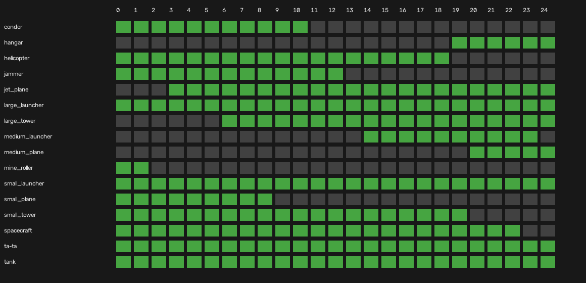
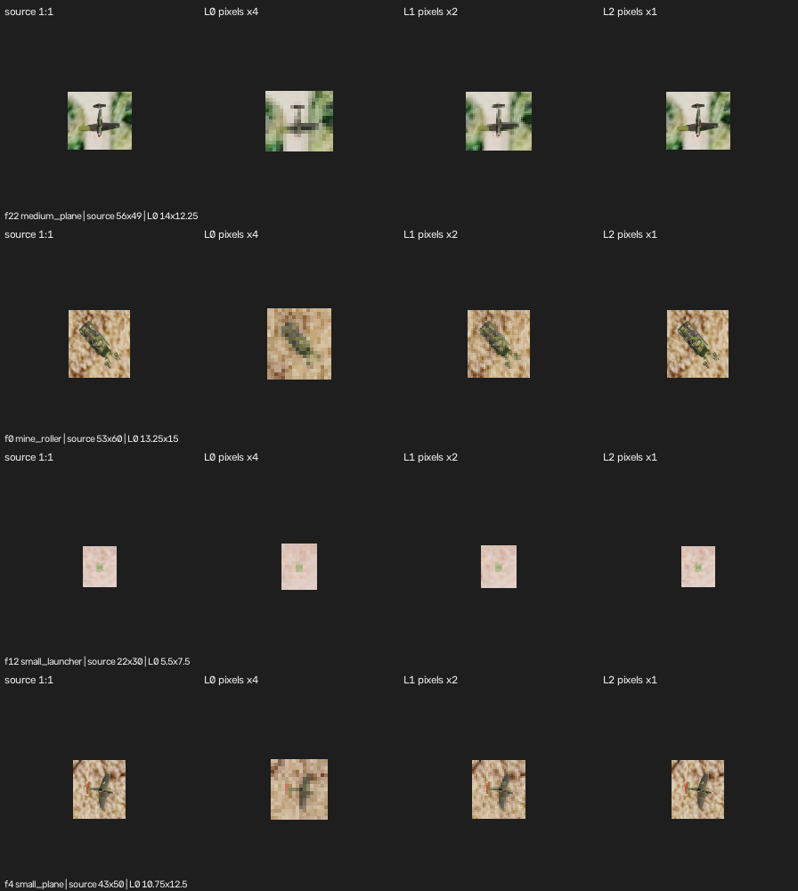
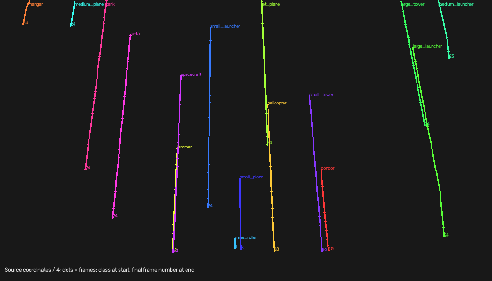

# Helsinki Dataset & Scene Audit

Evidence scope: the supplied Helsinki reference sequence, official camera renderer,
and completed evaluator probes. No model was selected or trained, no external
research was performed, and no official validation attempt was used.

**MEASURED** means counted or computed from Helsinki. **QUALITATIVE** means pixel
inspection, not model accuracy. **DERIVED** means an implication of measurements
or established evaluator behavior. **UNKNOWN** means not established here.
Plausible generalizations are identified explicitly and are not hidden-test claims.

The detailed per-class numeric tables are in [MEASUREMENTS.md](MEASUREMENTS.md).
[README.md](README.md) gives reproduction commands and definitions; the CSVs retain
every annotation, horizon, denominator and camera region. All 259 annotations have
multi-resolution visual rows indexed by [gallery_index.csv](gallery_index.csv).

## 1. Executive findings

* **MEASURED:** Integrity passes: 25 paired 3840x2160 images/annotation files,
  frames 0-24, 259 annotations, all 16 allowed classes, no gaps within a class's
  annotated interval and no duplicate class within a frame. Metadata explicitly
  describes one physical instance per class. This is 16 physical examples, not
  259 independent object examples.
* **MEASURED:** At L0, 181/259 boxes have a short side below 16 transmitted pixels;
  60/259 are below 8. Median short side is 12.25 pixels. Small launcher is only
  5-6 pixels on its short side throughout; ta-ta is 3.5-4.75. Scale and class detail
  are separate issues: neither a pixel count nor this inspection is detector accuracy.
* **MEASURED:** An unchanged box fails IoU 0.50 after just one frame in **all
  243 eligible transitions**. Two-box linear extrapolation succeeds in 227/227
  eligible next-frame comparisons, 207/212 at two frames, and 179/197 at three.
  Useful motion signal exists, but perfect initialization makes this optimistic.
* **MEASURED:** All 243 centroid displacements have positive y. Median speed is
  65.1 source pixels/frame (195.3 px/s at 3 FPS). Motion is smooth enough for
  short prediction, while extrapolation deteriorates at longer horizons.
* **MEASURED:** L1 covers 25% of source area and L2 6.25%. Target-centered L1
  retains a median of two other complete boxes; target-centered L2 isolates its
  target in 206/259 cases. Off-center shared crops can retain more: the exact
  maximum per frame is 4-6 objects at L1 and 2-3 at L2.
* **DERIVED:** The central challenge is jointly obtaining class detail and
  maintaining current global boxes outside the observed crop. Passive box reuse
  is insufficient here. **UNKNOWN:** robustness with real detections, other
  flights, multiple same-class objects, and hidden data.

## 2. Dataset inventory

**MEASURED:** The dataset contains 25 PNGs, 25 annotation JSONs and one metadata
JSON. Filenames are `frame_000000` through `frame_000024`, with identical image and
annotation frame sets, no extra files in those two directories, and all images
3840x2160. Per-frame counts range from 8 to 12; the full count sequence is in
[frame_inventory.csv](frame_inventory.csv). Total annotation count is 259.

Annotation schema is `frame`, `pose` (x/y/z), `annotations`, and `object_counts`.
Each annotation contains only `object_id` and integer source-pixel `[x1,y1,x2,y2]`.
`object_id` names a **class**, not a separate persistent instance identifier.
Allowed classes are the 16 rows in section 3, exactly matching `dtos.OBJECT_CLASSES`.
Counts agree with `object_counts`; every box has positive width/height and lies
within the source frame. There are no duplicate class/frame rows.

**MEASURED:** `run_metadata.json` says `total_objects=16` and one object for each
class. Together with one annotation per class/frame and coherent trajectories,
this justifies class correspondence **for Helsinki only**. It does not establish
a general identity mechanism.

**MEASURED:** 23 boxes lie within one pixel of an image edge. Annotation clipping
uses x2=3839 and y2=2159 at right/bottom edges. We flag distances <=1 as boundary
contact while retaining evaluator-compatible `x2-x1`, `y2-y1` geometry. A boundary
flag is evidence of possible truncation, not an occlusion label or an error.

Input SHA-256 hashes include every data file and evaluator/probe inputs. The run
verifies these files are unchanged. Work began on a clean `main` checkout and
uses branch `drone-dataset-scene-audit`; all new files are under `scene_audit/`.
Independent verification passes for all 4,669 saved IoU rows using center/size
arithmetic, annotation/summary denominators and complete gallery coverage; see
[validation_results.json](validation_results.json). The package is approximately
19.3 MiB including 68 PNGs, with no raw-frame copies or model caches.

## 3. Class occurrence and visibility

**MEASURED:** All intervals below are contiguous, with zero internal annotation
gaps. Annotation count equals number of frames present. Duration is `N/3`; the
first-to-last timestamp span is `(N-1)/3`, separately recorded in the CSV.

| Class | First-last frame | Count | Sampled duration s |
| --- | --- | --- | --- |
| condor | 0-10 | 11 | 3.67 |
| hangar | 19-24 | 6 | 2.00 |
| helicopter | 0-18 | 19 | 6.33 |
| jammer | 0-12 | 13 | 4.33 |
| jet_plane | 3-24 | 22 | 7.33 |
| large_launcher | 0-24 | 25 | 8.33 |
| large_tower | 6-24 | 19 | 6.33 |
| medium_launcher | 14-23 | 10 | 3.33 |
| medium_plane | 20-24 | 5 | 1.67 |
| mine_roller | 0-1 | 2 | 0.67 |
| small_launcher | 0-24 | 25 | 8.33 |
| small_plane | 0-8 | 9 | 3.00 |
| small_tower | 0-19 | 20 | 6.67 |
| spacecraft | 0-22 | 23 | 7.67 |
| ta-ta | 0-24 | 25 | 8.33 |
| tank | 0-24 | 25 | 8.33 |

**MEASURED:** Classes first appearing after frame 0 all enter at the top boundary.
Condor, helicopter, jammer, small tower and spacecraft end at the bottom boundary;
medium launcher ends at the right boundary. Small plane and mine roller end 3 and
10 source pixels from the bottom respectively. **DERIVED:** their downward motion
supports likely bottom exits, but the files do not explicitly annotate exit causes.
Frame-0 entries and frame-24 exits are censored by the recording window.

**DERIVED:** Many classes provide enough annotated frames for multiple camera
actions, but this is not universal. Starting at L0 on mine roller's frame 0 permits
L1 on frame 1; it has no annotated frame 2 for L2. A full L0→L1→L2→L1→L0 cycle
needs four subsequent accepted actions under the real adjacent-level rule, so
even the five-frame medium-plane interval offers little margin. Actions affect
future observations and host-dependent skipped frames may consume these windows.
No universal response-time threshold is inferred.

## 4. Object-scale analysis

**MEASURED:** Pooled median width is 53 source pixels, height 50, and area 2,650
pixels (0.0319% of source area). These are separate marginal medians. The full
geometry table includes width, height, area, normalized width/height/area, aspect
ratio, centroid, left/top/right/bottom distances and minimum edge distance.
Per-class and pooled min/p10/median/mean/p90/max are in
[class_summary.csv](class_summary.csv). Percentiles are descriptive interpolation
over very small, correlated samples, especially mine roller (N=2).

**DERIVED:** A small short side can mean a genuinely tiny object or a boundary
sliver. Hangar frame 19 is 182x6 source pixels, despite later boxes around 188x129.
Late medium launcher is visibly cut by the right edge. Treating these as uniformly
small physical objects would misread the scene.

## 5. L0/L1/L2 apparent scale

**MEASURED:** Apparent dimensions are source width/height divided by 4, 2, or 1.
They are ideal geometric extents; actual occupied pixel support depends on sampling
alignment, shape, contrast and occlusion. All source boxes fit a centered L2 crop.

| Class | Median L0 W x H px | Median L1 W x H px | Median L2 W x H px |
| --- | --- | --- | --- |
| condor | 43.25 x 41.5 | 86.5 x 83 | 173 x 166 |
| hangar | 46.25 x 29.75 | 92.5 x 59.5 | 185 x 119 |
| helicopter | 29 x 23.5 | 58 x 47 | 116 x 94 |
| jammer | 8.25 x 10.75 | 16.5 x 21.5 | 33 x 43 |
| jet_plane | 19.25 x 20.25 | 38.5 x 40.5 | 77 x 81 |
| large_launcher | 37.25 x 27.5 | 74.5 x 55 | 149 x 110 |
| large_tower | 15.5 x 16 | 31 x 32 | 62 x 64 |
| medium_launcher | 11.75 x 11.375 | 23.5 x 22.75 | 47 x 45.5 |
| medium_plane | 14 x 12.25 | 28 x 24.5 | 56 x 49 |
| mine_roller | 13.25 x 15 | 26.5 x 30 | 53 x 60 |
| small_launcher | 5.5 x 7.5 | 11 x 15 | 22 x 30 |
| small_plane | 10.75 x 12.5 | 21.5 x 25 | 43 x 50 |
| small_tower | 14.375 x 14.75 | 28.75 x 29.5 | 57.5 x 59 |
| spacecraft | 11 x 12.25 | 22 x 24.5 | 44 x 49 |
| ta-ta | 8 x 4.25 | 16 x 8.5 | 32 x 17 |
| tank | 12.5 x 11.75 | 25 x 23.5 | 50 x 47 |

| Level | Short <4 | 4-<8 | 8-<16 | 16-32 | >32 |
| --- | --- | --- | --- | --- | --- |
| L0 | 10 | 50 | 121 | 67 | 11 |
| L1 | 1 | 9 | 50 | 121 | 78 |
| L2 | 0 | 1 | 9 | 57 | 192 |

**MEASURED:** L0 <4 cases are tank f0, hangar f19, spacecraft f22, medium launcher
f23 and ta-ta f19-24. Small launcher stays in 4-<8 for all 25 frames. Exact
class/frame membership for every bucket and level is in
[scale_buckets.csv](scale_buckets.csv). These thresholds describe scale regimes;
they are not detector limits.

## 6. Multi-resolution visual observations

**Method:** Views use the official `render_view` implementation and lossless PNG
decode. L0 is the full-frame view; L1/L2 use legal, rounded/clamped object-centered
crops. We extract context around GT after rendering, then enlarge L0 by exactly
4 and L1 by 2 with **nearest neighbor**. Source and L2 are native scale. Thus the
comparison exposes sampling loss without inventing sharpness. All 259 annotation
rows are retained; representative rows are not a substitute for the full galleries.

**Inspection performed:** all 16 representative comparisons, all 25 frames as five
context strips, trajectory plot, and targeted temporal pages for boundary behavior.
This is not a blinded recognition experiment or an exhaustive independent review
of every gallery row. Small-launcher fine identity remains uncertain even at native
resolution. All following judgments are **QUALITATIVE** and specific to these views.

Evidence sheets: [A](figures/comparison_1.png), [B](figures/comparison_2.png),
[C](figures/comparison_3.png), [D](figures/comparison_4.png).

| Class / evidence | L0 information surviving | Meaningful L1 gain | Additional L2 gain / descriptive status |
| --- | --- | --- | --- |
| condor / A | Broad straight-wing aircraft silhouette is clear | Wing/body outlines and appendages separate better | Finer surface/edge detail; L0 appears sufficient for coarse aircraft recognition |
| hangar / A | Large dark roof-like mass, once fully in frame | Cleaner perimeter and adjacent structure | Texture/edge detail; limited extra coarse-shape information; early boundary sliver remains ambiguous |
| helicopter / A | Dark cross-like body and thin blurred extensions | Rotor/tail geometry becomes much clearer | Multiple thin rotor elements resolve more distinctly; strong structural gain over L0 |
| jammer / A | Small green rectangular equipment-like patch | Internal light/dark divisions and corners emerge | Finer top-surface structure; specific identity at L0 is weak |
| jet_plane / B | Aircraft outline with swept/triangular wings | Wing, tail and body separation is clearer | Sharper contours and small details; coarse aircraft shape survives L0 |
| large_launcher / B | Large elongated machinery silhouette | Separate chassis/raised structure becomes clearer | Thin vertical/support elements and surface pattern improve; L1 adds meaningful structure |
| large_tower / B | Rectangular dark/light structure | Framework/grid-like elements emerge | Finer lattice/roof lines; L0 lacks the structural cues visible at finer levels |
| medium_launcher / B | Compact dark patch in textured vegetation | Several narrow elongated elements become apparent | Those elements and their support resolve better; strong additional native detail |
| medium_plane / C | Cross-like aircraft silhouette | Body, wing and tail geometry separate | Thin body/tail details sharpen; extra detail matters more than coarse silhouette |
| mine_roller / C | Elongated olive vehicle-like patch | Main body divisions and a projecting end appear | Narrow forward apparatus resolves better; only two nearly adjacent examples |
| small_launcher / C | Tiny low-contrast pale-green spot | A little more internal contrast/shape | More source detail but very few pixels and low contrast; reliable class-specific interpretation remains insufficient |
| small_plane / C | Small cross-like/dark aircraft shape | Wings/body and small color accents emerge | Thin outlines and appendages improve; distinction from other small aircraft is more plausible at finer scale |
| small_tower / D | Olive rectangular center with pale surrounding base | Base versus center separates more clearly | Fine base/perimeter detail; visually different from large tower's open framework in these examples |
| spacecraft / D | Bright compact shape with dark center | Two side structures and central body emerge | Thin connecting edges sharpen; distinctive native silhouette, much less clear at L0 |
| ta-ta / D | Very short grey horizontal blob | Several protrusions become more visible | Thin appendages sharpen, but native height is still tiny; identity confidence cannot be established |
| tank / D | Olive angular equipment-like blob | Chassis/top structure separates | Narrow projection and surface detail improve; L0 similarity to other green equipment merits testing |

Context evidence: [frames 0-4](figures/sequence_strip_1.png),
[5-9](figures/sequence_strip_2.png), [10-14](figures/sequence_strip_3.png),
[15-19](figures/sequence_strip_4.png), [20-24](figures/sequence_strip_5.png).
Boundary evidence: [hangar f19-23](galleries/hangar_1.png),
[medium launcher f19-23](galleries/medium_launcher_2.png).

## 7. Motion and trajectories

**MEASURED:** 243 consecutive correspondences; speed range 28.1-80.3 source
pixels/frame, median 65.1. Every dy is positive. Per-class median speed ranges
from 46.3 (hangar, heavily affected by entry clipping) to 80.0 (mine roller, one
pair). Median center second difference is about 1.0-1.5 pixels for most classes,
4.8 for hangar; mine roller has no three-frame history. Complete displacement,
normalized displacement, dx/dy, width/height/area changes, area/scale ratios and
px/frame/px/s are in the motion CSVs and appendix.

**MEASURED:** Recorded altitude stays at z=-600; metadata states a 600 m capture
altitude and 13.8888889 m step. Pose changes from (0,0,-600) to approximately
(57.88,328.27,-600). **QUALITATIVE:** the shoreline/forest and objects move together
in the context strips. **DERIVED:** camera/flight geometry is a plausible dominant
source of apparent motion. World-static objects cannot be proven without further
world-state/camera-orientation data; no homography or calibrated physical-motion
model was fitted.

**DERIVED:** Objects are not image-stationary. Short-term motion is approximately
linear but smoothly changing, with clipping-induced box-center/size nonlinearities
at boundaries. Long-horizon constant velocity is inadequate (section 9). This is
not evidence of independent abrupt maneuvers by the depicted objects.

## 8. Stale-box IoU survival

**Method:** At each origin, hold the exact GT box fixed and evaluate all available
future GT frames. IoU uses evaluator-compatible continuous xyxy areas and the
inclusive 0.50 boundary. The survival horizon is the consecutive valid prefix
before first failure; targets after annotation disappearance are not evaluated.

**MEASURED:** At one frame (1/3 s), valid count is **0/243**, median IoU 0, mean
IoU 0.071. Every eligible origin has a zero-frame hold survival horizon, for every
class. Later horizons also have zero valid hold predictions. These are geometric
diagnostics, not detector/tracker AP.

**DERIVED:** Correct recognition alone does not support global scoring through a
crop excursion if the reported position is left unchanged. At least some motion
updating is necessary for this sequence. The established metric facts make this
strategically relevant: off-crop global predictions can score, but omitted predictions
retain GT, and stale boxes below 0.50 do not match. IoU beyond the threshold carries
no direct extra reward in the isolated matching case.

## 9. Simple extrapolation diagnostic

**Method:** Use exact GT at t-1 and t to estimate linear center and width/height
velocity. This equals linear xyxy corner extrapolation. Predict at t+h, clip to
global frame bounds, and score collapsed/inverted boxes as zero IoU. No training,
future-box fitting, or production tracking component is involved.

| Horizon | Time at 3 FPS | Hold valid / eligible | Extrapolation valid / eligible |
| --- | --- | --- | --- |
| 1 | 0.33 s | 0/227 | 227/227 |
| 2 | 0.67 s | 0/212 | 207/212 |
| 3 | 1.00 s | 0/197 | 179/197 |
| 4 | 1.33 s | 0/182 | 146/182 |
| 5 | 1.67 s | 0/168 | 104/168 |
| 6 | 2.00 s | 0/155 | 58/155 |
| 9 | 3.00 s | 0/117 | 0/117 |

**MEASURED:** This table uses identical eligible origins for both methods. Overall
median observed valid prefix for extrapolation is 4 frames; per-class medians
range from 2 to 7, excluding mine roller which has no eligible future target after
two observations. Maxima reach 8 frames. Class-specific results, all horizons and
right-censor flags are in the appendix and CSVs. Many prefixes end while still
valid because visibility or the recording ends: they are lower bounds, not measured
failure times. Horizon cohorts shrink and change composition.

**MEASURED:** At h=3, small launcher is valid 21/21 versus ta-ta 10/21; at h=4,
small launcher is 11/20 and ta-ta 0/20. Thus a global average hides substantial
class/geometry differences. Large launcher remains valid 18/18 at h=6.

**DERIVED:** Basic temporal prediction contains enough signal for brief global
continuity under ideal observations. **UNKNOWN:** achievable horizons with noisy
or misclassified detections, missed history, ambiguous identity, occlusion, or
nonconsecutive observations. The audit cannot estimate false persistence after
objects disappear because it conditions on future annotated GT. Re-observation
must eventually correct accumulated error; these numbers are not policy deadlines.

## 10. Camera-region geometry

**MEASURED:** All transmitted views are 960x540. L0 covers 8,294,400 source pixels
(100%); L1 2,073,600 (25%, sacrificing 75%); L2 518,400 (6.25%, sacrificing 93.75%).
L1 and L2 improve linear sampling by factors 2 and 4 relative to L0.

**Method:** Pair co-fit means the complete union of both boxes fits the crop.
Target-centered measurements use legal integer centers after clamping at frame
edges. A separate exact containment-boundary sweep finds maximum complete-object
counts in any static crop, including off-center crops. Partial intersections are
retained separately, not treated as complete recognition opportunities.

| Geometry measure | L1 | L2 |
| --- | --- | --- |
| Co-visible pair/frame cases fitting somewhere | 682/1223 | 189/1223 |
| Target-centered views containing no other complete box | 9/259 | 206/259 |
| Median other complete objects in target-centered view | 2 | 0 |
| Maximum other objects in target-centered view | 5 | 1 |
| Best static complete-object count per frame | 4-6 | 2-3 |

**MEASURED:** Helicopter and small tower fit together at L2 in all 19 co-visible
frames (median center separation 387 source pixels), and helicopter-centered L2
retains another object in all 19. Small launcher/ta-ta fit some L2 crop in all
25 common frames, as do ta-ta/tank; nevertheless centering L2 on small launcher
or ta-ta alone retains no other full box in any of their 25 frames. Pair fit and
target-centered retention are importantly different geometric questions.

**MEASURED:** Hangar/medium plane fit L2 in all five co-visible frames; median
separation is 402 pixels. Large tower/medium launcher fit L1 in 10/10 and L2 in
6/10. Large-launcher-centered L2 isolates it 25/25 times; L1 isolates it only
5/25. L1 centered on small launcher retains 1-5 other complete objects. Full class
sets, pair distances and frame-specific optimum sets are in the camera CSVs.

**DERIVED:** There are opportunities to inspect several objects together, including
tiny targets, but L2 usually removes other fresh visual evidence when centered on
a single target. It is inaccurate to say L2 *always* isolates one object. These
static results do not solve camera scheduling or guarantee transition reachability.
Allowed levels are adjacent; center-step limits are 2203/1102/551 source pixels
at current L0/L1/L2. Commands affect the next observation. Next-frame retention of
the same requested crop is recorded in `camera_centered.csv`; no final policy is designed.
**MEASURED:** Among 251 target origins before the final frame, 243 remain fully
inside the same centered crop on the next frame at both L1 and L2. The eight other
origins have no next-frame annotation for the target. Conditional on the target
remaining annotated, next-frame retention is therefore 243/243 at both levels.
This establishes short-step geometric margin, not a multi-step scheduling guarantee.

## 11. Visual confusion structure

The table describes **QUALITATIVE ambiguity candidates**, not a measured confusion
matrix or error rate. Labels alone were not used to infer appearance.

| Classes | Pixel evidence and likely ambiguity | Limitation |
| --- | --- | --- |
| jammer / tank / mine_roller | Sheets A/C/D show olive, equipment-like small patches at L0; finer views reveal different top structure and projections | Different size/background may aid this scene but cannot be relied on elsewhere; mine roller has only two frames |
| small_plane / medium_plane | Sheet C shows cross-like aircraft silhouettes compressed into roughly 11-14 by 12 px at L0; finer contours and body/tail details separate them better | Cannot measure a model's confusion or generalize from one instance each |
| jet_plane / other aircraft | Sheets A/B/C show a more swept/triangular jet silhouette versus straighter-wing aircraft; native contours strengthen distinction | Partial entry or downsampling can suppress these cues |
| small / medium / large launcher | Sheets B/C show a tiny pale spot, compact dark narrow-element structure, and much larger elongated machine, respectively | They are not demonstrated to be the strongest mutual-confusion pair; small launcher's actual fine identity is insufficiently resolved |
| small_tower / large_tower | Sheets B/D show a pale base with solid center versus a darker framework/grid-like structure | Labels do not imply identical silhouettes; low-resolution structural loss still makes a useful distinction harder |
| helicopter / small aircraft | Sheet A rotor/tail structure is thin and blurred at L0; finer sampling separates it | A plausible fine-structure ambiguity, not a demonstrated classification error |
| spacecraft / aircraft-like shapes | Sheet D has distinctive bright paired side structures at native scale; L0 compresses them | No reliable rival class can be assigned from this single instance |
| ta-ta / other tiny blobs | Sheet D's few-pixel grey strip loses appendage structure at L0 | Exact confusable class is unknown; declaring a particular pair would overstate the evidence |
| hangar / remaining objects | Sheet A shows a much larger dark roof-like patch, unlike the small equipment and aircraft examples | Scene-specific scale/context is not portable evidence of class uniqueness |

## 12. Likely perception bottlenecks

* **DERIVED — tiny, low-contrast recognition:** small launcher and ta-ta occupy
  very few L0 pixels; L2 cannot restore information absent from source pixels.
* **DERIVED — fine-grained structure:** aircraft, compact green equipment, rotors
  and frameworks gain visible distinguishing detail with zoom. Whether a learned
  recognizer needs that detail remains unknown.
* **DERIVED — global-state persistence:** an observation covers a crop while
  scoring accepts/needs current global boxes; holding old geometry fails here.
* **DERIVED — motion prediction and uncertainty:** smooth motion offers signal,
  but small boxes and accumulated error make horizons class-dependent. Boundary
  clipping changes observed center and size, complicating inference.
* **DERIVED — re-observation and coverage:** L2's information gain competes with
  losing most fresh scene evidence, and mine roller's two-frame window is short.
* **DERIVED from evaluator probes — confidence and duplicate discipline:** any
  persisted/global output needs confidence ranking that reflects uncertainty.
  Duplicates have rank-dependent cost and useful same-class detections after 100
  may be dropped. Helsinki's one instance/class/frame cannot stress that cap.

These are capability requirements, not selections of algorithms or architecture.

## 13. What zoom appears to buy us

**QUALITATIVE:** L1 often provides the first useful internal structure in green
equipment, the medium launcher, towers and spacecraft, and clearer rotor/aircraft
geometry. L2 adds finer edges, narrow elements and surface divisions beyond L1.
For large condor/hangar silhouettes, the extra gain is mostly finer structure rather
than a new coarse shape. Small launcher and ta-ta remain intrinsically small even
at native resolution; extra pixels do not prove reliable classification.

**MEASURED:** L1 reduces the number of <8-pixel-short-side observations from 60 to
10; L2 reduces it to one (the entering hangar sliver). These are sampling gains,
not accuracy gains. **DERIVED:** zoom research should measure marginal recognition
benefit against the loss of global freshness, separately by class and visibility
state. Geometry supports shared crops; there is no reason to assume all useful
zoom observations must isolate a single object.

## 14. What Helsinki cannot tell us

**UNKNOWN:** hidden-scene similarity, class appearances beyond these 16 instances,
real detector accuracy, actual confusion probabilities, optimal resolution per
class, robustness to multiple same-class objects, calibrated confidence, departure
handling, or production latency on a different host. No universal timing threshold
is imported from the evaluator probes.

**MEASURED/QUALITATIVE limitations:** only 25 frames from one flight, 2-25 correlated
annotations per class, eight seconds between first/last timestamps, one physical
object per class, a specific shoreline/forest environment, coherent flight motion,
particular orientation/scale/background combinations, rendered-looking assets,
and boundary-clipped annotations. The source offers no explicit occlusion or
instance-ID fields. Annotation correctness against exact visible object contours
was not independently relabeled, so tight-box quality remains an uncertainty.

Do not overfit class-to-coordinate maps, background/color shortcuts, one physical
scale per label, the order of entries/exits, single-instance correspondence, exact
velocity or stale horizon, or the assumption that all future flights are equally
smooth. A plausible generalization is that detail/coverage/persistence tradeoffs
will recur under this protocol; their numerical severity is unknown outside Helsinki.

## 15. Questions for targeted external research

1. How can recognition retain discriminative structure when the short side is
   roughly 4-16 pixels, and which gains require genuinely finer observations?
2. How can fine-grained aircraft/equipment distinctions be learned with appearance
   diversity beyond one physical instance and without background/scale shortcuts?
3. How can current full-frame object state be maintained from intermittent local
   observations, with explicit uncertainty for objects outside the crop?
4. Which motion representations handle camera-induced drift, changing scale and
   clipped boxes, and how does prediction degrade under noisy or skipped observations?
5. How can confidence decrease with stale evidence while preserving useful ranking
   and avoiding duplicate or false persistence after departure?
6. How can a re-observation scheduler balance class-detail gain, short visibility
   windows, global discovery and shared crop coverage under delayed constrained actions?
7. What evaluation design measures marginal L0→L1→L2 recognition gain and global
   AP impact without mistaking these oracle-IoU diagnostics for deployed accuracy?
8. What additional scenes, appearances and motion/occlusion conditions are needed
   to test transfer beyond this single flight before architecture selection?

These are the next research questions; no literature search has been conducted.

## 16. Implications for the next project phase

**Decision: sufficiently complete to proceed to targeted solution research.** All
12 completion questions have evidence or an explicit limit: scale/visibility/motion,
hold survival/extrapolation and camera coverage are quantified; L0/L1/L2 information
and confusion candidates are visually grounded; capability bottlenecks and research
questions are stated. The unresolved items are actual recognition/confusion accuracy,
reliable native identification of the smallest ambiguous objects, real prediction
robustness and transfer to unseen scenes. These require further evidence and must
remain unresolved rather than be inferred from these galleries.

Next-phase comparisons should investigate recognition at multiple real sampling
levels, uncertainty-aware global persistence, motion under imperfect history,
confidence behavior, and delayed camera re-observation with shared coverage. Use
this audit as a diagnostic baseline and hold out diverse scenes when available.
No winning architecture, detector, tracker or final camera policy is selected here.
The next phase has not been started.
